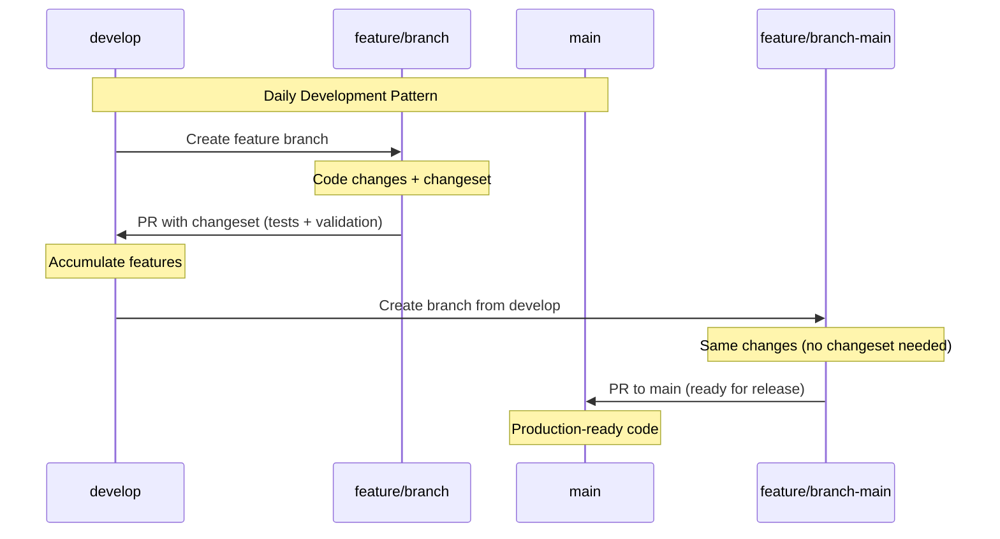
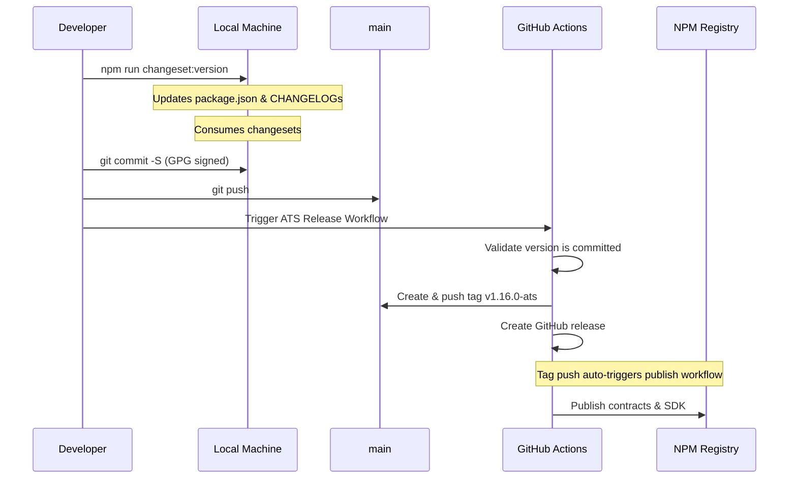
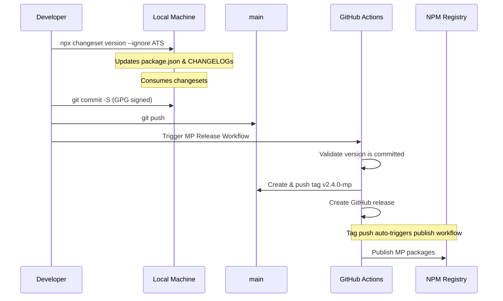
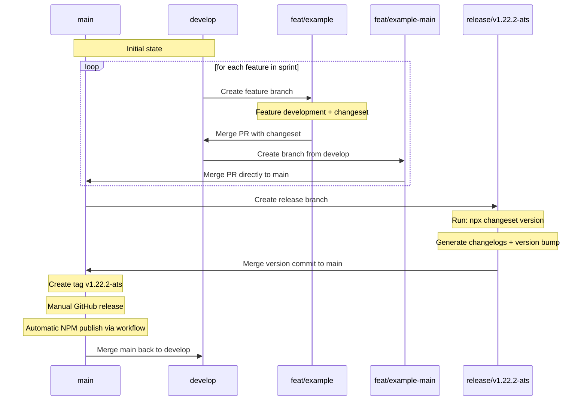
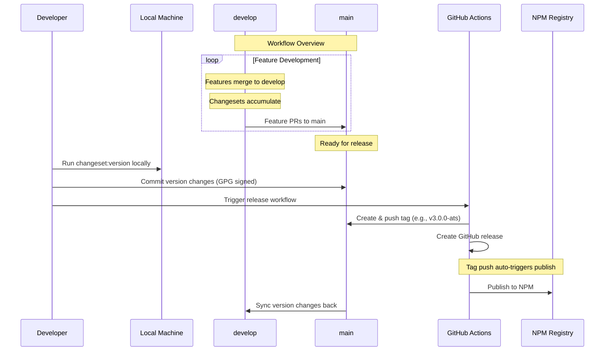

# GitHub Workflows Documentation

This document explains the CI/CD system for the Asset Tokenization Studio (ATS) monorepo, including development workflow, release processes, and how to work with changesets.

## Overview

The repository uses **Changesets** for version management with independent release cycles for:

- **ATS Project**: Asset Tokenization Studio (contracts, SDK, web app)
- **Mass Payout Project**: Mass payout functionality

All development happens on the `develop` branch with automated testing, changeset validation, and manual release controls by authorized teams.

## Developer Workflow

### Daily Development Process



### Step-by-Step Guide

1. **Create feature branch from develop**:

   ```bash
   git checkout develop && git pull origin develop
   git checkout -b feature/your-feature-name
   ```

2. **Make your changes** to ATS or Mass Payout packages

3. **Create changeset** (required for all PRs):

   ```bash
   npm run changeset
   ```

   - Select affected packages
   - Choose change type (patch/minor/major)
   - Write clear description

4. **Commit with DCO and Signature compliance**:

Commit messages should comply with the [conventional commits standard](https://www.conventionalcommits.org/en/v1.0.0/)

```bash
git add .
git commit --signoff -S -m "feat: your commit message"
git push origin feature/your-feature-name
```

5. **Open PR to develop branch** - automated checks will run

### Bypass Changeset Validation

For non-feature changes, add these labels to skip changeset requirement:

- `no-changeset`: Configuration or documentation changes
- `docs-only`: Documentation-only changes
- `chore`: Build system or dependency updates
- `hotfix`: Emergency fixes

## Workflow Reference

### Automated Workflows

| Workflow              | Trigger                      | Purpose                               |
| --------------------- | ---------------------------- | ------------------------------------- |
| **ATS Tests**         | PR to main, ATS file changes | Run ATS contracts, SDK, and web tests |
| **Mass Payout Tests** | PR to main, MP file changes  | Run Mass Payout package tests         |
| **Changeset Check**   | PR to develop                | Validate changeset or bypass labels   |

### Manual Release Workflows

| Workflow                | Purpose                              | Authorized Teams                                             |
| ----------------------- | ------------------------------------ | ------------------------------------------------------------ |
| **ATS Release**         | Version ATS packages, create release | platform-ci, release-engineering-managers, iobuilders-hedera |
| **Mass Payout Release** | Version MP packages, create release  | platform-ci, release-engineering-managers, iobuilders-hedera |

### Automatic Publishing

| Workflow                | Trigger           | Purpose                     |
| ----------------------- | ----------------- | --------------------------- |
| **ATS Publish**         | Tag push `v*-ats` | Publish ATS packages to npm |
| **Mass Payout Publish** | Tag push `v*-mp`  | Publish MP packages to npm  |

## Release Process

The repository supports **two release approaches**:

1. **Semi-Automated Release Workflows** (recommended for most releases)
2. **Manual Release Branches** (alternative for complex releases or when automation is unavailable)

### Option 1: Semi-Automated Release Workflows

**IMPORTANT:** All commits require GPG signatures. The version bump must be done manually on your local machine before triggering the release workflow.

#### ATS Release Flow



#### Mass Payout Release Flow



#### Manual Version Bump & Release Steps

**Step 1: Local Version Bump (Required)**

```bash
# For ATS release
npm run changeset:version
# Or manually ignore Mass Payout packages:
npx changeset version \
  --ignore "@mass-payout/contracts" \
  --ignore "@mass-payout/sdk" \
  --ignore "@mass-payout/backend" \
  --ignore "@mass-payout/frontend"

# Review changes
git diff

# Commit with GPG signature (REQUIRED)
git commit -S -m "chore: release ATS packages v3.0.0"

# Push to remote
git push
```

**Step 2: Trigger Release Workflow (GitHub UI)**

1. Go to **Actions** → **ATS Release** (or **Mass Payout Release**)
2. Click **Run workflow**
3. Select **preview** to dry-run, or **release** to create the release
4. The workflow will:
   - Validate that version bump is committed
   - Create and push git tag (e.g., `v3.0.0-ats`)
   - Create GitHub release with auto-generated notes
   - Trigger NPM publishing automatically

#### Release Options

Both workflows support:

- **Preview Mode**: Shows current version and what would be released (dry-run)
- **Release Mode**: Creates tag, GitHub release, and triggers publishing

**Important Notes:**

- All commits MUST be GPG-signed (hence manual version bump)
- The workflow will fail if uncommitted changes are detected
- The workflow will fail if the tag already exists
- Never run `changeset version` in CI - always do it locally

### Option 2: Manual Release Branches

For complex releases or when automation is unavailable, you can use the traditional manual release branch approach:



#### Manual Release Steps

1. **Create release branch from main**:

   ```bash
   git checkout main && git pull origin main
   git checkout -b release/v1.22.2-ats
   ```

2. **Apply changesets and version packages**:

   ```bash
   # For ATS release (ignore all Mass Payout packages)
   npx changeset version \
     --ignore "@mass-payout/contracts" \
     --ignore "@mass-payout/sdk" \
     --ignore "@mass-payout/backend" \
     --ignore "@mass-payout/frontend"

   # For Mass Payout release (ignore all ATS packages)
   npx changeset version \
     --ignore "@hashgraph/asset-tokenization-contracts" \
     --ignore "@hashgraph/asset-tokenization-sdk"
   ```

3. **Commit version changes**:

   ```bash
   git add .
   git commit --signoff -S -m "chore: release v1.22.2-ats"
   git push origin release/v1.22.2-ats
   ```

4. **Merge release branch to main**:
   - Create PR from `release/v1.22.2-ats` to `main`
   - Review and merge the version changes

5. **Create and push tag**:

   ```bash
   git tag v1.22.2-ats
   git push origin v1.22.2-ats
   ```

   - Tag push automatically triggers publish workflow
   - Optionally create GitHub release for release notes

6. **Sync main back to develop**:
   ```bash
   git checkout develop
   git merge main
   git push origin develop
   ```

**Benefits of Manual Release Branches**:

- ✅ Full control over version timing and content
- ✅ Ability to make additional changes during release process
- ✅ Works with existing automated publishing workflows
- ✅ Suitable for complex releases requiring manual intervention

### Release Authorization

Only these teams can trigger releases:

- `platform-ci`
- `platform-ci-committers`
- `release-engineering-managers`
- `developer-advocates`
- `iobuilders-hedera`
- Users containing `hashgraph`

## Workflow Interactions



## Troubleshooting

### Common Issues

**❌ Changeset check failed**

- **Solution**: Create changeset with `npm run changeset` or add bypass label

**❌ "Uncommitted changes detected" in release workflow**

- **Solution**: Run `changeset:version` locally and commit changes before triggering release workflow
- **Cause**: Version bump must be done manually with GPG signature

**❌ "Tag already exists" in release workflow**

- **Solution**: Check if version was already released or if version bump didn't occur
- Use `git tag -l` to list existing tags

**❌ "No changesets found to be bumped"**

- **Solution**: Ensure changesets exist for the project you're releasing
- Use `npm run changeset:status` to check pending changes

**❌ GPG signing error during commit**

- **Solution**: Configure GPG key for Git:
  ```bash
  git config --global user.signingkey YOUR_GPG_KEY_ID
  git config --global commit.gpgsign true
  ```
- Verify GPG key is available: `gpg --list-secret-keys --keyid-format=long`

**❌ Release workflow unauthorized**

- **Solution**: Ensure you're member of authorized teams listed in CODEOWNERS

**❌ Tests failing on PR**

- **Solution**: Run `npm run ats:test` or `npm run mass-payout:test` locally
- Fix failing tests before requesting review

**❌ DCO check failed**

- **Solution**: Ensure all commits use `--signoff` flag:
  ```bash
  git commit --signoff -S -m "your message"
  ```

### Getting Help

- **Changesets documentation**: [Changesets Intro](https://github.com/changesets/changesets/blob/main/docs/intro-to-using-changesets.md)
- **Check pending releases**: `npm run changeset:status`
- **Preview releases**: `npm run release:preview`
- **Local development**: See `CLAUDE.md` for complete development setup

## Quick Commands

```bash
# Development
npm run changeset                 # Create changeset
npm run changeset:status         # Check pending changes
npm run ats:test                 # Run ATS tests
npm run mass-payout:test         # Run MP tests

# Preview releases
npm run release:preview          # Show all pending releases
npm run release:ats             # Preview ATS release (local)
npm run release:mp              # Preview MP release (local)
```
