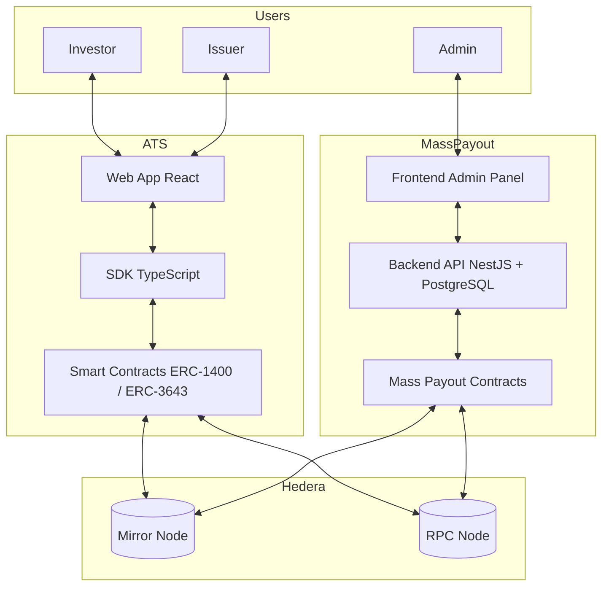

<div align="center">

# Asset Tokenization Studio

[](LICENSE)

</div>

## Introduction

The **Asset Tokenization Studio (ATS) Monorepo** provides a unified environment to design, deploy, and operate tokenized financial assets on the **Hedera network**, as well as to manage **large-scale payout distributions**.

It brings together two complementary suites:

- **Asset Tokenization Studio (ATS):** Tools for creating, managing, and interacting with **security tokens** (equities and bonds) that comply with enterprise-grade standards.
- **Scheduler Payment Distribution (Mass Payout):** Infrastructure to execute **batch payments** (e.g., dividends, bond coupons, recurring obligations) efficiently across thousands of accounts.

This monorepo is structured with **npm workspaces** and is designed for scalability, modularity, and enterprise adoption.

---

## Key Features

- **Tokenization Framework**
  - Security tokens compliant with **ERC-1400** and partial support for **ERC-3643 (T-REX)**.
  - Modular **diamond pattern architecture** for upgradeability.
  - Identity registry, compliance modules, and granular freeze controls.
  - Role-based access control with administrative and operational roles.

- **Mass Payout Framework**
  - Batch operations optimized for large-scale distributions.
  - Supports both **HBAR** and **HTS tokens**.
  - Lifecycle cash flow management for recurring obligations.
  - Gas-optimized operations and proxy-based upgradeable contracts.

- **Enterprise Development Practices**
  - **Domain-Driven Design (DDD)**, **Hexagonal Architecture**, and **CQS pattern**.
  - Separation of concerns across smart contracts, SDKs, frontends, and backends.
  - Strong CI/CD workflows with conditional builds and tests for each module.
  - Custodian integration at the SDK level (Dfns, Fireblocks, AWS KMS).

## Monorepo Structure

```
├── packages/
│ ├── ats/
│ │ ├── contracts # Solidity smart contracts for ATS
│ │ └── sdk # TypeScript SDK for ATS contracts
│ └── mass-payout/
│ ├── contracts # Solidity smart contracts for payout flows
│ └── sdk # TypeScript SDK for payout flows
├── apps/
│ ├── ats/
│ │ └── web # Frontend dApp for Asset Tokenization Studio
│ ├── mass-payout/
│ │ ├── backend # API backend for payout orchestration
│ │ └── frontend # Admin panel for managing payouts
│ └── docs # Documentation site (Docusaurus)
├── docs/ # Technical documentation
│ ├── adr/ # Architecture Decision Records
│ ├── proposals/ # Enhancement Proposals
│ ├── guides/ # Developer Guides
│ └── workflows/ # CI/CD Documentation
└── package.json # Workspace configuration and root scripts
```

## Documentation

This project follows a **"Docs-as-Code"** philosophy, treating documentation with the same rigor as software. We maintain three distinct documentation layers:

### Layer 1: Technical Documentation (Target: Developers)

Located in the repository root and co-located within packages:

- **Root README.md**: High-level project overview
- **Module READMEs**: Package-specific documentation in `packages/` and `apps/`
- **CONTRIBUTING.md**: Engineer's handbook covering GitFlow, environment setup, and release processes
- **Developer Guides** (`docs/guides/`): Step-by-step tutorials for complex tasks
- **Architecture Decision Records** (`docs/adr/`): Historical record of architectural decisions
- **Enhancement Proposals** (`docs/proposals/`): Feature specifications and design proposals

### Layer 2: Documentation Hub (Target: All Users)

A public-facing Docusaurus site located at `apps/docs` that aggregates:

- **Product Manuals**: End-user guides and tutorials
- **Developer Guides**: Synced from Layer 1
- **API Reference**: Auto-generated from TypeScript (TypeDoc) and Solidity (solidity-docgen)
- **Architecture Documentation**: System design and patterns

### Layer 3: Internal Documentation (Target: Employees)

Sensitive information kept in Confluence (restricted access):

- Credentials and client data
- HR processes and meeting minutes
- Strategic roadmap discussions (pre-public phase)

### ADRs vs. Enhancement Proposals

We distinguish between two types of decision documents:

- **ADRs (Architecture Decision Records)**: Document decisions **already made**, providing historical context and consequences
- **EPs (Enhancement Proposals)**: Propose **new features or changes** before implementation, enabling community discussion via Pull Requests

This approach is inspired by industry standards like Kubernetes KEPs, Ethereum EIPs, and Hedera HIPs.

### Documentation Commands

```bash
# Start documentation site locally
npm run docs:dev

# Build documentation site
npm run docs:build

# Serve built documentation
npm run docs:serve
```

For more details, see:

- [How to Create an ADR](docs/adr/README.md)
- [How to Submit an Enhancement Proposal](docs/proposals/README.md)
- [Developer Guides](docs/guides/README.md)

## Architecture

### High-Level Overview



## Installation & Setup

### Prerequisites

- Node.js
  - ATS requires v20.19.4 or newer
  - Mass Payout backend requires v24.0.0 or newer
- npm v10.9.0 or newer
- PostgreSQL (for the Mass Payout backend)

### Quick Setup

From the monorepo root:

```bash

# Install all dependencies
npm ci
```

```bash
# Build all packages and applications
npm run setup
```

This command will compile contracts, build SDKs, and set up web and backend environments.

### Environment Configuration

Each application has its own .env configuration file.

- ATS Web App: apps/ats/web/.env.local
  Defines Hedera endpoints, resolver and factory IDs, and WalletConnect settings.

- Mass Payout Backend: apps/mass-payout/backend/.env
  Includes PostgreSQL connection and runtime configuration.

- Mass Payout Frontend: apps/mass-payout/frontend/.env
  Requires VITE_API_URL and VITE_PORT.

Sample files are provided (.env.sample or .env.example) in each module.

## Development Workflows

### ATS

```bash
npm run ats:build       # Build contracts, SDK, and web app
npm run ats:start       # Start web app (with contracts & SDK built)
npm run ats:test        # Run tests for all ATS modules
```

- Contracts (packages/ats/contracts) → Solidity, Hardhat, diamond pattern
- SDK (packages/ats/sdk) → TypeScript SDK for client and web integration
- Web App (apps/ats/web) → React 18 frontend for asset management

### Mass Payout

```bash
npm run mass-payout:build         # Build contracts, SDK, backend, and frontend
npm run mass-payout:backend:dev   # Start backend in dev mode
npm run mass-payout:frontend:dev  # Start frontend in dev mode
npm run mass-payout:test          # Run all payout-related tests
```

- Contracts (packages/mass-payout/contracts) → Solidity payout contracts
- SDK (packages/mass-payout/sdk) → TypeScript SDK for payout execution
- Backend (apps/mass-payout/backend) → API with PostgreSQL
- Frontend (apps/mass-payout/frontend) → Admin panel in React + Chakra UI

## Testing

Run tests for all modules:

```bash
npm run ats:test
npm run mass-payout:test
```

Each submodule provides additional test options (unit, e2e, coverage).

## Architecture Highlights

### Smart Contracts

- Diamond pattern with modular facets (ERC-1400, ERC-3643, Hold, Clearing)
- Role-based access control with fine-grained permissions

### SDKs

- TypeScript APIs for deploying and managing securities, payouts, compliance, and lifecycle events
- Batch operations for minting, burning, freezing, and payouts

### Applications

- **ATS Web**: dApp for asset issuance and management
- **Mass Payout Backend**: Orchestrates scheduled payouts
- **Mass Payout Frontend**: Admin dashboard for payout monitoring

### Integrations

- Hedera Mirror Node and RPC Node
- WalletConnect for dApp integration
- Custodian libraries: Dfns, Fireblocks, AWS KMS

## Continuous Integration

The project uses separate GitHub Actions workflows for different components:

- **ATS Tests** (`.github/workflows/test-ats.yml`): Runs when ATS-related files change
- **Mass Payout Tests** (`.github/workflows/test-mp.yml`): Runs when Mass Payout files change
- **Publishing** (`.github/workflows/publish.yml`): Handles publishing to npm with conditional logic based on release tags

Tests are automatically triggered only when relevant files are modified, improving CI efficiency.

## Support

If you have a question on how to use the product, please see our
[support guide](https://github.com/hashgraph/.github/blob/main/SUPPORT.md).

## Contributing

Contributions are welcome. Please see the
[contributing guide](https://github.com/hashgraph/.github/blob/main/CONTRIBUTING.md)
to see how you can get involved.

## Code of conduct

This project is governed by the
[Contributor Covenant Code of Conduct](https://github.com/hashgraph/.github/blob/main/CODE_OF_CONDUCT.md). By
participating, you are expected to uphold this code of conduct. Please report unacceptable behavior
to [oss@hedera.com](mailto:oss@hedera.com).

## License

[Apache License 2.0](LICENSE)

## Security

Please do not file a public ticket mentioning the vulnerability. Refer to the security policy defined in the [SECURITY.md](https://github.com/hashgraph/assettokenization-studio/blob/main/SECURITY.md).
