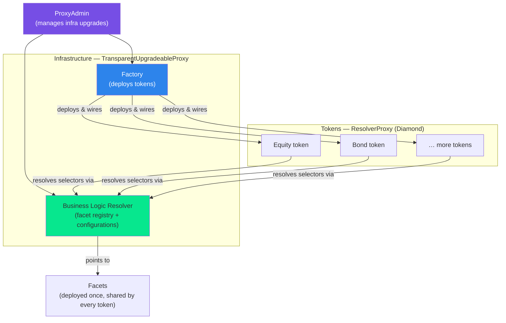
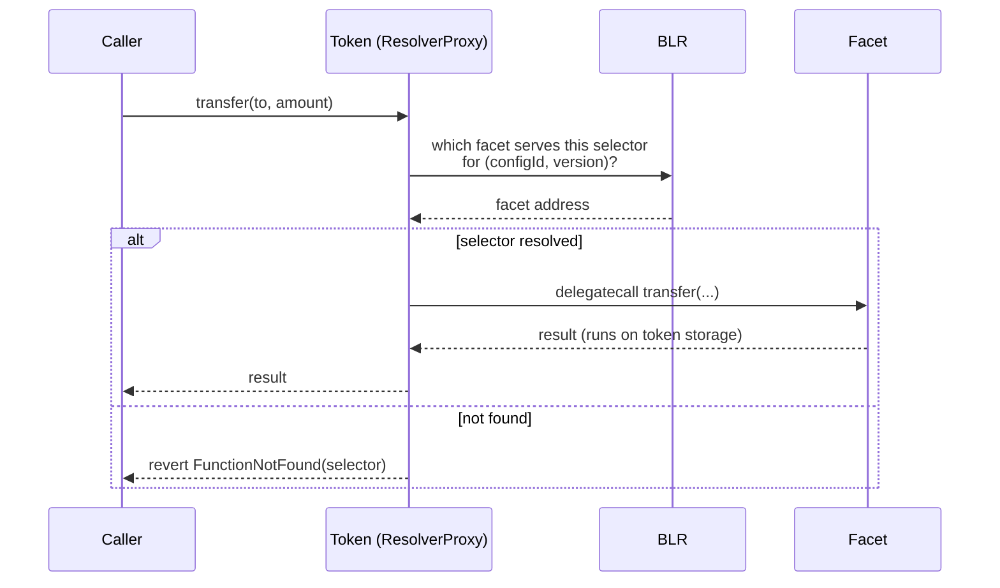
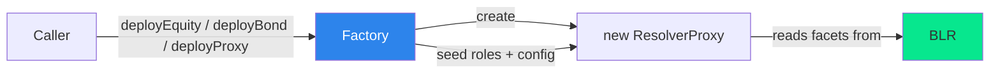

# Architecture

How the ATS contracts fit together at runtime: the Diamond pattern, the Business Logic Resolver,
the per-token proxies, and the factory that ties them together. If you only read one architecture
page, read this one.

## Big picture

Every token is an **EIP-2535 Diamond** — a thin proxy that holds the state and delegates each
function call to a _facet_ (a feature module). Rather than each token storing its own facet map,
all tokens share a central **Business Logic Resolver (BLR)** that maps feature keys to versioned
facet addresses. A **Factory** deploys new tokens and wires them to the BLR. Two
infrastructure contracts — the BLR and the Factory — sit behind upgradeable OpenZeppelin proxies
managed by a **ProxyAdmin**.

## Two proxy patterns

ATS deliberately uses **two different proxy mechanisms** for two different jobs. Confusing them is
the most common source of upgrade mistakes, so keep the distinction clear:

|                        | **TransparentUpgradeableProxy (TUP)**                     | **ResolverProxy (Diamond)**                               |
| ---------------------- | --------------------------------------------------------- | --------------------------------------------------------- |
| **Used for**           | BLR, Factory (infrastructure)                             | Equity / Bond / Loan / … tokens                           |
| **What it points at**  | A single implementation contract                          | A _configuration_ of many facets                          |
| **How you upgrade it** | Swap the implementation via `ProxyAdmin`                  | Point it at a newer configuration version                 |
| **Who controls it**    | `ProxyAdmin` owner                                        | The token's `DEFAULT_ADMIN_ROLE`                          |
| **Guide**              | [Upgrading infrastructure](./upgrading-infrastructure.md) | [Upgrading configurations](./upgrading-configurations.md) |

- **TUP** is the standard OpenZeppelin pattern: one proxy, one implementation, upgraded by the admin.
- **ResolverProxy** is the Diamond pattern: one proxy, _many_ facets, resolved per function call
  through the BLR. "Upgrading" a token never changes its proxy bytecode — it changes which
  configuration version the proxy resolves against.

## The Business Logic Resolver (BLR)

The BLR — [`infrastructure/diamond/BusinessLogicResolver.sol`](https://github.com/hashgraph/asset-tokenization-studio/blob/main/packages/ats/contracts/contracts/infrastructure/diamond/BusinessLogicResolver.sol) —
is the registry at the heart of the system. It stores two things:

1. **Business logics (facets).** A mapping from a `bytes32` **resolver key** to versioned facet
   addresses. Registering or updating _any_ facet bumps a single, **shared latest version** so that
   a chosen version is guaranteed consistent across every key
   (`registerBusinessLogics`, `resolveLatestBusinessLogic`, `resolveBusinessLogicByVersion`).
2. **Configurations.** Via its parent [`IDiamondCutManager`](https://github.com/hashgraph/asset-tokenization-studio/blob/main/packages/ats/contracts/contracts/infrastructure/diamond/IDiamondCutManager.sol),
   the BLR also stores **configurations**: named, independently-versioned sets of facets that
   together define an asset type (Equity, Bond, …). Each configuration is identified by a
   `bytes32` configuration ID and answers "for this asset type at this version, which facet serves
   this selector?".

A configuration can also maintain a **selector blacklist** — selectors that are disabled for that
asset type even if a facet would otherwise serve them.

See [Core concepts](./core-concepts.md) for resolver keys, configuration IDs, and versioning, and
[Managing the BLR](./managing-the-blr.md) for the operations.

## How a function call resolves

A token (`ResolverProxy`,
[`infrastructure/proxy/ResolverProxy.sol`](https://github.com/hashgraph/asset-tokenization-studio/blob/main/packages/ats/contracts/contracts/infrastructure/proxy/ResolverProxy.sol))
stores its `resolver` address plus its `resolverProxyConfiguration` (configuration ID + version). On
any call whose selector it doesn't implement directly, its fallback asks the BLR which facet serves
that selector for its configuration, then `delegatecall`s the facet so the code runs against the
token's own storage.

Each facet declares the selectors it serves and its resolver key through
[`IStaticFunctionSelectors`](https://github.com/hashgraph/asset-tokenization-studio/blob/main/packages/ats/contracts/contracts/infrastructure/proxy/IStaticFunctionSelectors.sol),
which is how configurations are assembled and validated.

## The Factory

The Factory ([`factory/Factory.sol`](https://github.com/hashgraph/asset-tokenization-studio/blob/main/packages/ats/contracts/contracts/factory/Factory.sol),
exposed as a facet via `FactoryFacet`) deploys new tokens. It offers typed entry points per asset
class plus a generic one:

- `deployEquity(EquityData, FactoryRegulationData)`
- `deployBond(BondData, FactoryRegulationData)`
- `deployDepositToken(DepositTokenData, FactoryRegulationData)`
- `deployProxy(resolver, configKey, version, rbacs, data)` — the generic entry point used for any
  configuration (including bond variants and loans); see [Deploying an asset proxy](./deploying-an-asset-proxy.md).

:::note
There is no separate `deployBondFixedRate` / `deployBondKpiLinkedRate` / `deployLoan` function. The
bond variant (or loan) is selected by the **configuration ID** passed in
`SecurityData.resolverProxyConfiguration.key`, not by a dedicated method.
:::

Each deploy call creates a `ResolverProxy`, wires it to the BLR with the chosen configuration ID and
version, seeds the initial roles (`Rbac[]`), and initialises the relevant facets.

## Lifecycle flows

**Create a token** — `Factory.deployEquity(...)` → new `ResolverProxy` is created, pinned to the
Equity configuration's current version, roles seeded, facets initialised → token is live.

**Upgrade a token's logic** — deploy improved facet(s) → `registerBusinessLogics` in the BLR (bumps
the shared version) → create a new **configuration version** referencing the new facets → point
tokens at the new version (pinned) or let auto-update tokens pick it up. No token redeployment.
See [Upgrading configurations](./upgrading-configurations.md).

**Upgrade the infrastructure** — deploy a new BLR or Factory implementation → `ProxyAdmin` swaps the
implementation behind the TUP. Token contracts are unaffected.
See [Upgrading infrastructure](./upgrading-infrastructure.md).

## Logical layers

The contracts are organised by _responsibility_, not by deep folder nesting. Conceptually there are
four logical layers — storage wrappers, core standards, domain features, and jurisdiction-specific
behaviour — but on disk the facets sit in flat folders. (The old `layer_0…layer_3` directories were
flattened in the refactor and now exist only as empty remnants.) The next page,
[Repository structure](./repository-structure.md), shows exactly where everything lives.
