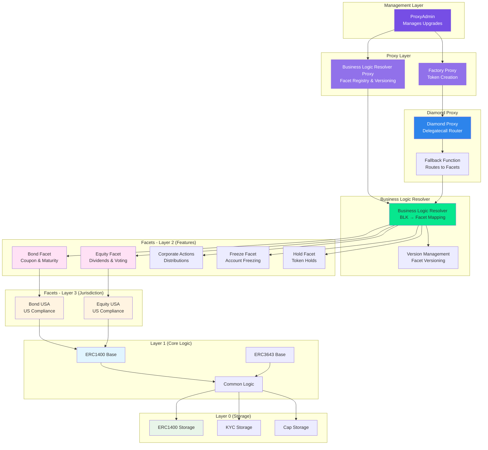

# ATS Contracts Developer Guide

Comprehensive guides for developing, deploying, and maintaining ATS smart contracts.

## Overview

The Asset Tokenization Studio (ATS) contracts provide a modular, upgradeable smart contract system for security tokens (ERC-1400/ERC-3643) on the Hedera network using the Diamond Pattern (EIP-2535).

## Guides

### [Deployment Tutorial](./deployment.md)

Complete guide to deploying the ATS contract system including:

- Infrastructure setup (ProxyAdmin, BLR, Factory)
- Facet deployment (46+ contracts)
- Configuration creation (Equity & Bond)
- Verification and troubleshooting

### [Adding a New Facet](./adding-facets.md)

Step-by-step guide for creating and integrating new facets:

- Facet anatomy and structure
- Storage wrapper creation
- Interface definitions
- Testing and integration
- Best practices and examples

### [Upgrading Facets](./upgrading.md)

Guide for safely upgrading facets and configurations:

- Understanding the versioning system
- Upgrade procedures
- Production deployment workflow
- Rollback procedures
- Testing strategies

### [Documenting Contracts](./documenting-contracts.md)

Guide for writing and generating smart contract documentation:

- NatSpec format and best practices
- Documenting functions, events, and storage
- Generating API documentation
- Documentation workflow
- Common patterns in ATS

## Quick Links

- [Architecture Documentation](https://github.com/hashgraph/asset-tokenization-studio/blob/main/packages/ats/contracts/ARCHITECTURE.md)
- [Scripts Developer Guide](https://github.com/hashgraph/asset-tokenization-studio/blob/main/packages/ats/contracts/scripts/DEVELOPER_GUIDE.md)
- [Scripts API Reference](https://github.com/hashgraph/asset-tokenization-studio/blob/main/packages/ats/contracts/scripts/README.md)
- [Contracts README](https://github.com/hashgraph/asset-tokenization-studio/blob/main/packages/ats/contracts/README.md)
- [Source Code](https://github.com/hashgraph/asset-tokenization-studio/tree/main/packages/ats/contracts)

## System Architecture

### Diamond Pattern (EIP-2535) Implementation

The ATS contracts use the Diamond Pattern for modularity and upgradeability:



### Architecture Overview

```
┌─────────────────────────────────────────┐
│         ProxyAdmin                      │
│  (Manages proxy upgrades)               │
└─────────────────────────────────────────┘
                  │
        ┌─────────┴─────────┐
        │                   │
┌───────▼──────────┐  ┌────▼────────────┐
│ BLR Proxy        │  │ Factory Proxy   │
│ (Facet Registry) │  │ (Token Creator) │
└───────┬──────────┘  └─────────────────┘
        │
        ├─ 46+ Facets (Layer 2 & 3)
        └─ 2 Configurations (Equity & Bond)
```

### Key Components

<div className="card-grid card-grid-2">
  <div className="card-box card-info">
    <h3>🔷 Diamond Proxy</h3>
    <p>Routes function calls to appropriate facets</p>
    <ul>
      <li>Delegatecall to facets</li>
      <li>Function selector mapping</li>
      <li>Storage layout preservation</li>
      <li>Gas-efficient routing</li>
    </ul>
  </div>

  <div className="card-box card-info">
    <h3>📋 Business Logic Resolver</h3>
    <p>Maps Business Logic Keys to facet addresses</p>
    <ul>
      <li>Versioned facet registry</li>
      <li>Dynamic facet lookup</li>
      <li>Configuration management</li>
      <li>Upgrade coordination</li>
    </ul>
  </div>

  <div className="card-box card-tip">
    <h3>🏭 Factory</h3>
    <p>Deploys new token instances</p>
    <ul>
      <li>Clone diamond proxies</li>
      <li>Initialize configurations</li>
      <li>Set up permissions</li>
      <li>Deploy identity contracts</li>
    </ul>
  </div>

  <div className="card-box card-tip">
    <h3>🔧 Facets</h3>
    <p>Modular business logic components</p>
    <ul>
      <li>Independent upgrades</li>
      <li>Feature isolation</li>
      <li>Shared storage access</li>
      <li>Version compatibility</li>
    </ul>
  </div>
</div>

### Benefits of Diamond Pattern

:::info Why Diamond Pattern?

- **Modularity**: Each facet can be upgraded independently
- **Gas Efficiency**: Share storage and logic across contracts
- **No Size Limits**: Bypass the 24KB contract size limit
- **Flexibility**: Add or remove functionality without redeployment
- **Upgradeability**: Safe upgrade path for production contracts
  :::

## Prerequisites

- Node.js v20.19.4 or newer
- npm v10.9.0 or newer
- Hedera account with sufficient HBAR
- Understanding of Diamond Pattern (EIP-2535)
- Basic Solidity knowledge

## Getting Started

1. **First Time?** Start with the [Deployment Tutorial](./deployment.md)
2. **Adding Features?** See [Adding a New Facet](./adding-facets.md)
3. **Upgrading?** Read [Upgrading Facets](./upgrading.md)

## Support

For questions and issues:

- [GitHub Issues](https://github.com/hashgraph/asset-tokenization-studio/issues)
- [GitHub Discussions](https://github.com/hashgraph/asset-tokenization-studio/discussions)
