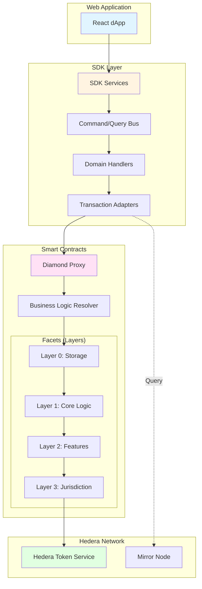

# Developer Guides

Technical guides for developers building with or extending Asset Tokenization Studio.

## Architecture Overview

ATS uses a modular, layered architecture designed for flexibility and upgradeability.

| Component     | Technology                           | Purpose                               |
| ------------- | ------------------------------------ | ------------------------------------- |
| **Web App**   | React 18, Zustand, Material-UI       | User interface for token management   |
| **SDK**       | TypeScript, tsyringe, CQRS           | Programmatic access to all operations |
| **Contracts** | Solidity, Diamond Pattern (EIP-2535) | On-chain token logic and compliance   |
| **Hedera**    | HTS, Mirror Node, RPC                | Blockchain infrastructure             |

---

## Available Guides

### Smart Contracts

  

    <h4>Contract Architecture</h4>
    
Deep dive into the Diamond Pattern and 4-layer design

    <a href="./contracts/overview">View Guide →</a>
  

  

    <h4>Deployed Addresses</h4>
    
Current contract addresses for testnet and mainnet

    <a href="./contracts/deployed-addresses">View Addresses →</a>
  

  

    <h4>Deployment</h4>
    
Deploy the ATS contract system

    <a href="./contracts/deployment">View Guide →</a>
  

  

    <h4>Adding Facets</h4>
    
Create and integrate new facets

    <a href="./contracts/adding-facets">View Guide →</a>
  

  

    <h4>Upgrading Facets</h4>
    
Safely upgrade facets in production

    <a href="./contracts/upgrading">View Guide →</a>
  

  

    <h4>Documenting Contracts</h4>
    
Write contract documentation with NatSpec

    <a href="./contracts/documenting-contracts">View Guide →</a>
  

### SDK Integration

  

    <h4>SDK Integration</h4>
    
Quick guide to integrate the ATS SDK in your project

    <a href="./sdk-integration">View Guide →</a>
  

  

    <h4>SDK Overview</h4>
    
Detailed overview of SDK architecture and available operations

    <a href="./sdk-overview">View Guide →</a>
  

### Web Application

_Coming soon_ - Learn how to customize and extend the ATS web application.

---

## Key Architectural Patterns

| Pattern                        | Where Used      | Purpose                                                 |
| ------------------------------ | --------------- | ------------------------------------------------------- |
| **Diamond Pattern (EIP-2535)** | Smart Contracts | Modular, upgradeable contracts without size limits      |
| **CQRS**                       | SDK             | Separate read (queries) and write (commands) operations |
| **Hexagonal Architecture**     | SDK             | Decouple business logic from infrastructure (adapters)  |
| **Dependency Injection**       | SDK             | Testable, loosely coupled components via tsyringe       |

## Quick Links

- [API Documentation](../api/index.md) - Technical reference
- [User Guides](../user-guides/index.md) - Application usage
- [GitHub Repository](https://github.com/hashgraph/asset-tokenization-studio)
