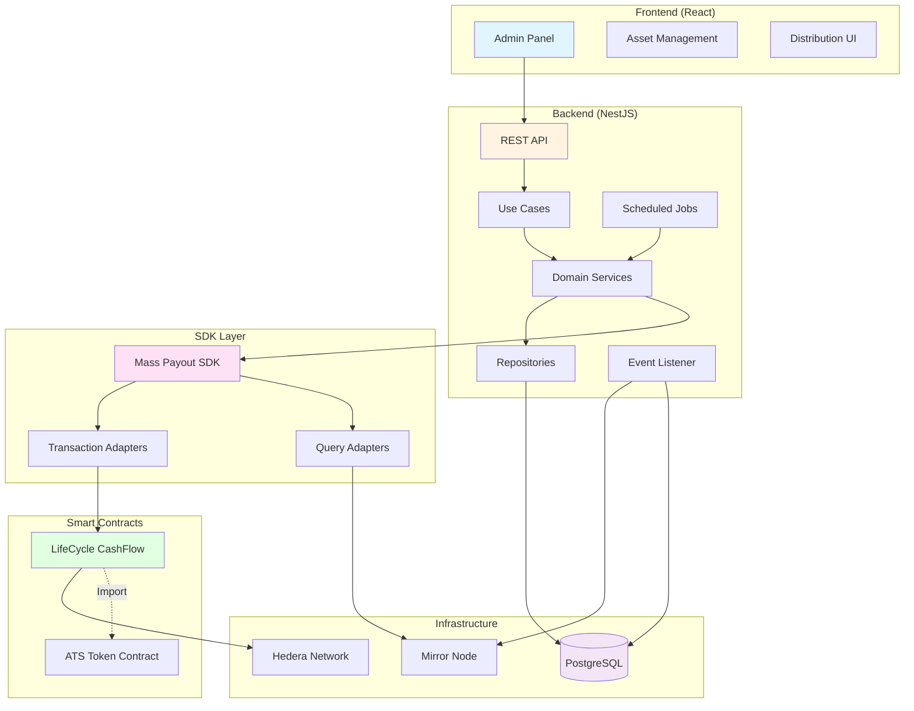
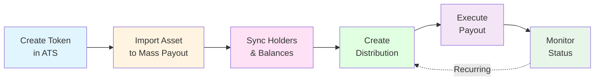

# Mass Payout

Manage large-scale payment distributions for tokenized securities with automated batch processing and scheduling capabilities.

## Overview

Mass Payout is a comprehensive payment distribution system designed for tokenized securities. It enables issuers to efficiently distribute dividends, coupon payments, and other recurring obligations to large numbers of token holders on the Hedera network.

### Key Features

- **Batch Payment Processing**: Efficiently distribute payments to thousands of token holders
- **Asset Import**: Automatically sync token holders and balances from ATS tokens
- **Multiple Distribution Types**: Support for dividends, coupon payments, and custom distributions
- **Scheduled Payouts**: Set up recurring distributions with cron-like scheduling
- **Real-time Tracking**: Monitor payout status and transaction history
- **Failure Recovery**: Automatic retry mechanism for failed payments
- **REST API**: Complete backend API for integration

## Architecture

Mass Payout consists of four main components working together:

Mass Payout consists of four main components:

### Smart Contracts

The **LifeCycle Cash Flow** contract manages all on-chain operations:

- **Distribution Execution**: Batch transfer payments to multiple recipients
- **Bond Cash-Out**: Handle bond maturity redemptions
- **Snapshot Management**: Capture holder balances at specific points in time
- **Role-Based Access**: Granular permissions for different operations
- **Upgradeable**: Proxy pattern for contract upgrades

[Learn more about contracts →](./developer-guides/contracts/index.md)

### SDK

TypeScript SDK for blockchain interactions:

- **Command/Query Pattern**: Separation of write and read operations
- **Transaction Adapters**: Support for DFNS, RPC, and other signers
- **Value Objects**: Type-safe representation of blockchain entities
- **Mirror Node Integration**: Query historical data and events

[Learn more about SDK integration →](./developer-guides/sdk-integration.md)

### Backend (NestJS)

Domain-driven backend API with PostgreSQL:

- **Domain Services**: Business logic for asset import, payout execution, and synchronization
- **Event-Driven Sync**: Automatic blockchain event polling and processing
- **Use Cases**: 22 use cases covering all operations
- **Repositories**: TypeORM for data persistence
- **Scheduled Jobs**: Cron-based automatic payout execution

[Learn more about backend →](./developer-guides/backend/index.md)

### Frontend (React)

Admin panel for managing distributions:

- **Asset Management**: Import assets and view holder information
- **Distribution Creation**: Configure and execute payouts
- **Real-time Monitoring**: Track payout status and history
- **Chakra UI**: Modern, accessible component library
- **React Query**: Efficient data fetching and caching

[Try the web app →](./getting-started/quick-start.md)

## Use Cases

  

    <h3>💵 Dividend Distributions</h3>
    
Distribute earnings to equity token holders

    <ul>
      <li>Import equity tokens from ATS</li>
      <li>Calculate amounts per share</li>
      <li>Execute batch payments</li>
      <li>Track history and reporting</li>
    </ul>
    <a href="./user-guides/creating-distributions.md" className="card-link">Learn more</a>
  

  

    <h3>📅 Coupon Payments</h3>
    
Automate periodic bond interest payments

    <ul>
      <li>Import bond tokens from ATS</li>
      <li>Schedule periodic payments</li>
      <li>Auto-execute on schedule</li>
      <li>Handle proration</li>
    </ul>
    <a href="./user-guides/creating-distributions.md" className="card-link">Learn more</a>
  

  

    <h3>🔄 Recurring Distributions</h3>
    
Set up automated recurring payouts

    <ul>
      <li>Cron-based schedules</li>
      <li>Auto snapshot capturing</li>
      <li>Automatic retry on failure</li>
      <li>Real-time progress tracking</li>
    </ul>
    <a href="./user-guides/creating-distributions.md" className="card-link">Learn more</a>
  

## Integration with ATS

Mass Payout is designed to work seamlessly with Asset Tokenization Studio:

1. **Create tokens in ATS**: Issue equity or bond tokens
2. **Import to Mass Payout**: Sync token holder information
3. **Configure distributions**: Set up payment parameters
4. **Execute payouts**: Distribute payments to holders

You can use Mass Payout independently if you have existing tokens on Hedera.

### ATS Integration Requirements

When using Mass Payout with ATS tokens, ensure the following:

**Required Permissions**:

- The Mass Payout operator account (DFNS account configured in backend) must have the **SNAPSHOT_ROLE** granted in the ATS token contract
- This role is required for manual payments that capture balance snapshots
- Grant roles in ATS: Token Settings → Roles → Grant SNAPSHOT_ROLE
- See [ATS Roles and Permissions](../ats/user-guides/roles-and-permissions.md#snapshot_role) for details

**Token Holders**:

- In ATS, creating accounts or "holder records" doesn't make them on-chain holders
- Tokens must be **minted** to addresses before they become actual holders
- Mass Payout only distributes payments to addresses with non-zero token balances
- Always verify holder balances in ATS before creating distributions

For troubleshooting common integration issues, see [Creating Distributions - Troubleshooting](./user-guides/creating-distributions.md#troubleshooting).

## Getting Started

  

    <h3>👤 For End Users</h3>
    
Want to try the Mass Payout web application and distribute payments?

    <ul>
      <li>Quick start in minutes</li>
      <li>No coding required</li>
      <li>Import assets from ATS</li>
      <li>Create and manage distributions</li>
      <li>Monitor payout status</li>
    </ul>
    <a href="./getting-started/quick-start" className="card-link">Quick Start Guide</a>
  

  

    <h3>👨‍💻 For Developers</h3>
    
Integrate Mass Payout or contribute to the codebase

    <ul>
      <li>Full development environment</li>
      <li>Backend + Frontend setup</li>
      <li>SDK integration</li>
      <li>Contract deployment</li>
      <li>Custom integrations</li>
    </ul>
    <a href="./getting-started/full-setup" className="card-link">Full Development Setup</a>
  

## Documentation

  

    <h3>📚 User Guides</h3>
    
Step-by-step guides for using the Mass Payout web application

    <ul>
      <li>Importing assets from ATS</li>
      <li>Creating distributions</li>
      <li>Managing payouts and holders</li>
      <li>Scheduled and recurring distributions</li>
    </ul>
    <a href="./user-guides/" className="card-link">View Guides</a>
  

  

    <h3>🛠️ Developer Guides</h3>
    
Technical guides for developers

    <ul>
      <li>Smart contract deployment</li>
      <li>SDK integration and usage</li>
      <li>Backend architecture patterns</li>
      <li>Frontend customization</li>
    </ul>
    <a href="./developer-guides/" className="card-link">View Guides</a>
  

  

    <h3>📖 API Documentation</h3>
    
Technical reference for contracts, SDK, and REST API

    <ul>
      <li>Smart contract functions</li>
      <li>SDK classes and methods</li>
      <li>REST API endpoints</li>
      <li>Code examples</li>
    </ul>
    <a href="./api/" className="card-link">View API Docs</a>
  

## Technical Stack

### Backend

- **NestJS**: TypeScript Node.js framework
- **PostgreSQL**: Relational database for persistence
- **TypeORM**: Object-relational mapping
- **Domain-Driven Design**: Clean architecture patterns

### Frontend

- **React 18**: Modern UI framework
- **Chakra UI**: Component library
- **React Query**: Data fetching and caching
- **Zustand**: State management

### Blockchain

- **Hedera Network**: DLT platform
- **Solidity**: Smart contract language
- **Hardhat**: Development environment

## System Requirements

- **Node.js**: v24.0.0 or newer
- **PostgreSQL**: 12 or newer
- **npm**: v10.9.0 or newer
- **Hedera Account**: With HBAR for transactions

## Support and Resources

- [GitHub Repository](https://github.com/hashgraph/asset-tokenization-studio)
- [Report Issues](https://github.com/hashgraph/asset-tokenization-studio/issues)
- [Hedera Documentation](https://docs.hedera.com)
- [Hedera Discord](https://hedera.com/discord)

## License

Licensed under Apache License 2.0. See [LICENSE](https://github.com/hashgraph/asset-tokenization-studio/blob/main/LICENSE) for details.
