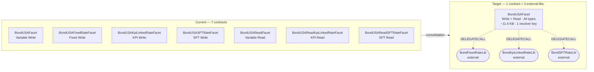
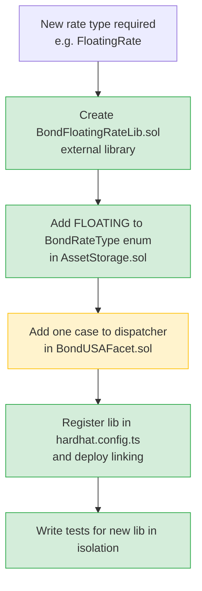

# ADR: Bond Domain Unification — Single Facet Architecture

```
╔══════════════════════════════════════════════════════════════════════════════╗
║  ARCHITECTURE DECISION RECORD — PROPOSAL                                    ║
║  Asset Tokenisation Studio (ATS)                                            ║
╠══════════════════════════════════════════════════════════════════════════════╣
║  Status:      Proposed                                                      ║
║  Date:        2026-02-26                                                    ║
║  Principle:   One domain = one facet                                        ║
╚══════════════════════════════════════════════════════════════════════════════╝
```

---

## Decision

Consolidate all Bond USA facets (currently **7 contracts**) into a **single `BondUSAFacet`**
combining write and read for all rate types, using **external libraries** for
rate-calculation logic to remain within the EIP-170 24 KB limit.

## Context

Bond was split per rate type (Variable, Fixed, KPI-Linked, SPT) as a tactical workaround
for the 24 KB bytecode limit. A bond is a single product domain. The split inflates
deploy complexity, duplicates selectors, and multiplies resolver keys without reflecting
any real domain boundary.

## Architecture



> External libraries operate on Diamond storage via `DELEGATECALL`. Storage positions
> are already explicit `bytes32 constant` slots — collision risk is mitigated by design.

## Consequences

| ✅ Gains                                               | ⚠️ Trade-offs                                 |
| ------------------------------------------------------ | --------------------------------------------- |
| 7 contracts → 1 facet + 3 libs                         | External lib linking in deploy config         |
| Single resolver key for bond domain                    | `DELEGATECALL` storage discipline required    |
| ~11.6 KB facet — ample room to grow                    | 2-phase migration (internal libs → external)  |
| New rate type = new lib only, facet unchanged          | Gas overhead: +~700 gas per external lib call |
| Consistent with `EquityUSAFacet` (write+read unified)  |                                               |
| Libs reusable by future bond variants (`BondEU`, etc.) |                                               |

---

---

## Annex A — Bytecode Size Analysis

### Current facets

| Contract                        | Size     | % of 24 KB limit |
| ------------------------------- | -------- | ---------------- |
| `BondUSAFacet` (variable write) | 9,159 B  | 37%              |
| `BondUSAFixedRateFacet`         | 9,346 B  | 38%              |
| `BondUSAKpiLinkedRateFacet`     | 14,356 B | 58%              |
| `BondUSASPTRateFacet`           | 13,552 B | 55%              |
| `BondUSAReadFacet`              | 10,450 B | 43%              |
| `BondUSAReadKpiLinkedRateFacet` | 13,307 B | 54%              |
| `BondUSAReadSPTRateFacet`       | 12,888 B | 52%              |

### Unified facet estimation

| Component                                     | Delta                         |
| --------------------------------------------- | ----------------------------- |
| Shared base (write + read, libs inlined once) | ~10,450 B                     |
| Fixed rate unique logic                       | +187 B                        |
| KPI-Linked write + read unique logic          | +8,054 B                      |
| SPT write + read unique logic                 | +6,831 B                      |
| Enum dispatch + init                          | +300 B                        |
| **Option 2 — internal libs total**            | **~25,822 B ❌ over limit**   |
| **Option 3 — external libs total**            | **~11,600 B ✅ 47% of limit** |

The option with internal libraries exceeds the EIP-170 limit by ~1,246 bytes even before
adding future rate types. External libraries are the only path that supports a true
single-facet-per-domain model with room to grow.

---

## Annex B — Options Evaluated

Four architectural options were assessed:

```
Option 1 — Abstract internal contracts per rate type
  BondUSA inherits multiple abstract calculators simultaneously.
  ✗ C3 linearisation conflicts when overriding the same function (setCoupon).
  ✗ Semantically identical to Option 2 but with worse compiler properties.
  → Discarded.

Option 2 — Internal library (LibBondRateCalculation)
  All rate logic consolidated into one large internal library.
  ✗ Unified facet (write+read) reaches ~25,822 B — over the 24 KB limit.
  ✓ Valid if write and read remain as two separate facets (~18 KB each).
  → Viable for partial unification only.

Option 3 — External libraries per rate type  ← SELECTED
  Each rate-calculation variant is an independently deployed library.
  Rate logic executes via DELEGATECALL on Diamond storage.
  ✓ Facet bytecode: ~11.6 KB. Full write+read unification is possible.
  ✓ Adding a new rate type = new library only; facet is unchanged.
  ✓ Deploy linking pattern already exists (TREXBondDeploymentLib).

Option 4 — Hybrid / exploratory
  Explored as the basis for Option 3. The key insight:
  rate-type selection should happen at deploy time (Diamond installs the right
  facet) or via an in-storage enum dispatching to external libs — not via
  inheritance proliferation.
```

---

## Annex C — Impact Analysis

### Compilation

| Metric                             | Current             | After unification                                  |
| ---------------------------------- | ------------------- | -------------------------------------------------- |
| Bond-related source files compiled | 14 `.sol`           | 5 `.sol` (1 facet + 3 libs + storage)              |
| Inherited contract chains          | Up to 3 levels deep | 1 level (facet + interfaces)                       |
| Compile time (bond subset)         | Baseline            | **−30–40%** (fewer files, less duplicate inlining) |
| `via-ir` required                  | No                  | No                                                 |

### Tests

| Metric                    | Impact                                                              |
| ------------------------- | ------------------------------------------------------------------- |
| Existing bond test suites | Must be updated: single deploy, enum param in `_initialize_bondUSA` |
| Test isolation            | Improved — one fixture instead of four                              |
| New test surface          | Enum dispatch paths, storage-slot validation for each external lib  |
| Estimated test delta      | ~−40% fixture boilerplate, +10% new dispatch coverage tests         |

### Coverage

| Metric                         | Impact                                                                         |
| ------------------------------ | ------------------------------------------------------------------------------ |
| Coverage tooling compatibility | No change — `hardhat-coverage` supports external libs natively                 |
| Coverage accuracy              | **Improves** — shared code measured once instead of duplicated across 7 facets |
| Uncovered paths                | External lib DELEGATECALL paths require explicit test cases per rate type      |

### Maintainability

```
Before                              After
──────────────────────────────────  ──────────────────────────────────
Shared logic change → touch 4–7     Shared logic change → touch 1 file
contracts
New rate type → new directory +     New rate type → new lib file +
mirror all interfaces               1 enum value + 1 dispatch case
Deploy config → 4+ resolver keys    Deploy config → 1 resolver key
Audit surface → 7 contracts with    Audit surface → 1 facet (dispatcher)
duplicated validation code          + isolated libs (pure calculation)
```

### Deployment & Operations

| Metric                           | Current                     | After                                            |
| -------------------------------- | --------------------------- | ------------------------------------------------ |
| Contracts deployed per bond type | 2 (write + read facet)      | 4 total, shared (1 facet + 3 libs deployed once) |
| Resolver keys for bond domain    | 7                           | 1                                                |
| Diamond upgrade scope            | Replace 1–2 facets per type | Replace 1 facet for all bond logic               |
| Gas: `setCoupon` / `getCoupon`   | Baseline                    | +~700 gas per call (1 external lib dispatch)     |

> The gas overhead of ~700 gas applies to coupon operations only — infrequent,
> operator-level actions. It is not relevant to transfer or balance operations.

---

## Annex D — Extension Strategy for New Rate Types

With this architecture, adding a new interest rate type follows a fully additive process
with zero changes to existing contracts:



**Rule:** A new rate type creates a new library. The facet grows by ~30 bytes (one dispatch
case). No existing contract is modified. No existing test is broken.

**Split threshold:** If a rate-calculation library exceeds ~200 lines of logic, consider
splitting it into a calculation lib + a storage accessor lib, following the existing
`LibInterestRate` / `ScheduledStorage` separation pattern.

---

## Annex E — Storage Safety with External Libraries

External libraries using `DELEGATECALL` operate on the **caller's storage** (the Diamond
proxy). This is identical in principle to how all current `Lib*` internal libraries
access Diamond storage — the difference is that with external libraries the compiler
cannot verify slot alignment at compile time.

**Why the risk is already mitigated in this project:**

```
All storage positions are explicit bytes32 constants:

  _FIXED_RATE_STORAGE_POSITION
  _KPI_LINKED_RATE_STORAGE_POSITION
  _SUSTAINABILITY_PERFORMANCE_TARGET_RATE_STORAGE_POSITION
  _BOND_STORAGE_POSITION
  ...

External libraries access storage exclusively via these accessor functions
(fixedRateStorage(), kpiLinkedRateStorage(), etc.) — never via struct
member variables declared inside the library itself.
```

**Rule to enforce:** External rate libraries **must not** declare any `storage` variables
at the library level. All state is accessed through the existing `ScheduledStorage.sol`
and `AssetStorage.sol` accessor functions with their explicit slot constants.

---

## Annex F — Migration Phasing

A two-phase approach minimises risk:

```
Phase 1 — Unify write + read with internal libs (Option 2)
  Target: BondUSAFacet (write only, ~18 KB) + BondUSAReadFacet (read only, ~15 KB)
  Validates: enum dispatch, initialisation signature, test suite updates.
  No external lib risk at this stage.

Phase 2 — Merge into single facet with external libs (Option 3)
  Target: Single BondUSAFacet (write + read, ~11.6 KB)
  Requires: lib deployment, hardhat linking, DELEGATECALL storage validation tests.
  Validates: full domain unification, resolver key consolidation.
```

This phasing allows the team to validate the domain model and test suite in Phase 1
before introducing the external library mechanism in Phase 2.
