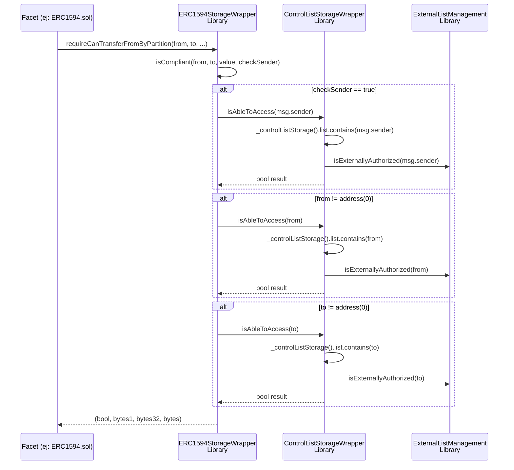

# ERC1594StorageWrapper Dependency Analysis

## Diagrama de Dependencias

```mermaid
flowchart TB
    subgraph Layer_0_Domain["Layer 0 - Domain Storage (Libraries)"]
        CLS[ControlListStorageWrapper<br/>Library]
        E1594[ERC1594StorageWrapper<br/>Library<br/>439 líneas]
        E3643[ERC3643StorageWrapper<br/>Library]
        KYC[KycStorageWrapper<br/>Library]
        E1410[ERC1410StorageWrapper<br/>Library]
        E20[ERC20StorageWrapper<br/>Library]
        CLEAR[ClearingStorageWrapper<br/>Library]
    end

    subgraph Layer_1_Facets["Layer 1 - Core Facets"]
        E1594F[ERC1594.sol<br/>Facet]
        E3643M[ERC3643Management.sol<br/>Facet]
        E3643B[ERC3643Batch.sol<br/>Facet]
        E3643O[ERC3643Operations.sol<br/>Facet]
        E20F[ERC20.sol<br/>Facet]
        E1410M[ERC1410Management.sol<br/>Facet]
        E1410T[ERC1410TokenHolder.sol<br/>Facet]
        E1410I[ERC1410Issuer.sol<br/>Facet]
        E1410R[ERC1410Read.sol<br/>Facet]
        CLEAR_A[ClearingActions.sol<br/>Facet]
        HOLD_T[HoldTokenHolder.sol<br/>Facet]
    end

    subgraph Layer_2_Domain["Layer 2 - Domain Facets"]
        BOND[Bond.sol<br/>Facet]
        E20P[ERC20Permit.sol<br/>Facet]
        HOLD[HoldStorageWrapper<br/>Library]
    end

    %% ERC1594StorageWrapper Dependencies (imports)
    E1594 -->|import| CLS
    E1594 -->|import| E3643
    E1594 -->|import| KYC
    E1594 -->|import| E1410
    E1594 -->|import| E20
    E1594 -->|import| CLEAR

    %% ControlList call chain
    E1594 -.->|isAbleToAccess| CLS
    HOLD -.->|isAbleToAccess| CLS

    %% Layer 1 facets that import ERC1594StorageWrapper
    E1594F -->|import| E1594
    E3643M -->|import| E1594
    E3643B -->|import| E1594
    E3643O -->|import| E1594
    E20F -->|import| E1594
    E1410M -->|import| E1594
    E1410T -->|import| E1594
    E1410I -->|import| E1594
    E1410R -->|import| E1594
    CLEAR_A -->|import| E1594
    HOLD_T -->|import| E1594

    %% Layer 2 facets
    BOND -->|import| CLS
    E20P -->|import| CLS
    HOLD -->|import| CLS

    %% Call relationships
    E1594F -->|requireCanTransferFromByPartition| E1594
    E3643M -->|isCompliant| E1594
    E3643B -->|isCompliant| E1594
    E3643O -->|isCompliant| E1594
    E20F -->|requireCanTransferFromByPartition| E1594
    E1410M -->|requireCanTransferFromByPartition| E1594
    E1410T -->|requireCanTransferFromByPartition| E1594
    HOLD_T -->|requireCanTransferFromByPartition| E1594

    %% Styling
    classDef library fill:#e1f5ff,stroke:#0077b6,stroke-width:2px
    classDef facet fill:#fff4e6,stroke:#ff8c00,stroke-width:2px
    classDef abstract fill:#f0f0f0,stroke:#666,stroke-width:2px,stroke-dasharray: 5 5

    class CLS,E1594,E3643,KYC,E1410,E20,CLEAR,HOLD library
    class E1594F,E3643M,E3643B,E3643O,E20F,E1410M,E1410T,E1410I,E1410R,CLEAR_A,HOLD_T,BOND,E20P facet
```

## Análisis de Impacto

### 🔴 Si ERC1594StorageWrapper se convierte a Abstract Contract

**Archivos afectados (11 facets):**

| Facet                  | Layer   | Uso de ERC1594StorageWrapper       |
| ---------------------- | ------- | ---------------------------------- |
| ERC1594.sol            | Layer 1 | Heredaría de ERC1594StorageWrapper |
| ERC3643Management.sol  | Layer 1 | Heredaría de ERC1594StorageWrapper |
| ERC3643Batch.sol       | Layer 1 | Heredaría de ERC1594StorageWrapper |
| ERC3643Operations.sol  | Layer 1 | Heredaría de ERC1594StorageWrapper |
| ERC20.sol              | Layer 1 | Heredaría de ERC1594StorageWrapper |
| ERC1410Management.sol  | Layer 1 | Heredaría de ERC1594StorageWrapper |
| ERC1410TokenHolder.sol | Layer 1 | Heredaría de ERC1594StorageWrapper |
| ERC1410Issuer.sol      | Layer 1 | Heredaría de ERC1594StorageWrapper |
| ERC1410Read.sol        | Layer 1 | Heredaría de ERC1594StorageWrapper |
| ClearingActions.sol    | Layer 1 | Heredaría de ERC1594StorageWrapper |
| HoldTokenHolder.sol    | Layer 1 | Heredaría de ERC1594StorageWrapper |

**Refactor requerido:**

- 439 líneas de librería → abstract contract
- 11 facets necesitan cambiar `import` → `inheritance`
- HoldStorageWrapper también necesita convertirse

### 🟡 Si ControlListStorageWrapper se convierte a Abstract Contract

**Problema:** ERC1594StorageWrapper (librería) no puede llamar funciones de abstract contract.

**Solución requerida:**

1. Convertir ERC1594StorageWrapper también a abstract contract, O
2. Crear dual function pattern (internal + public), O
3. Mantener ControlList como librería ✅

### ✅ Estado Actual (Ambos Libraries)

**Ventajas:**

- 0 facets afectados
- Mínima duplicación de código
- Patrón consistente con AccessControlStorageWrapper (library → abstract ya completado)
- Compilación exitosa (416 contratos)

**Trade-off:**

- Facets usan `checkControlList()` en lugar de modifier
- Bond.sol y ERC20Permit.sol ya actualizados

---

## Call Chain para `isAbleToAccess`

---

## Recomendación

**Mantener ambos como librerías** es la opción de menor impacto:

| Opción               | Impacto                           | Riesgo      | Complejidad     |
| -------------------- | --------------------------------- | ----------- | --------------- |
| Ambos libraries      | ✅ Mínimo (2 facets)              | ✅ Bajo     | ✅ Simple       |
| ControlList abstract | ❌ 11 facets + ERC1594            | ❌ Alto     | ❌ Compleja     |
| ERC1594 abstract     | ❌ 11 facets                      | ❌ Alto     | ❌ Compleja     |
| Ambos abstract       | ❌ 11 facets + HoldStorageWrapper | ❌ Muy alto | ❌ Muy compleja |

**Decisión:** ✅ Mantener estado actual (ambos librerías)
