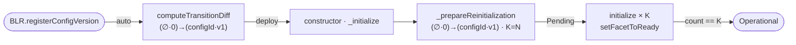
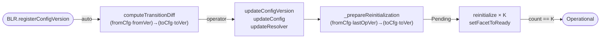
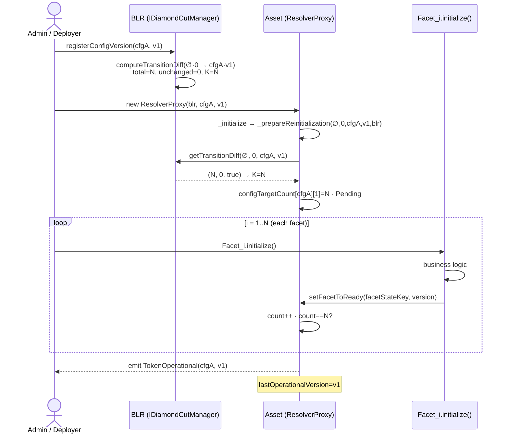
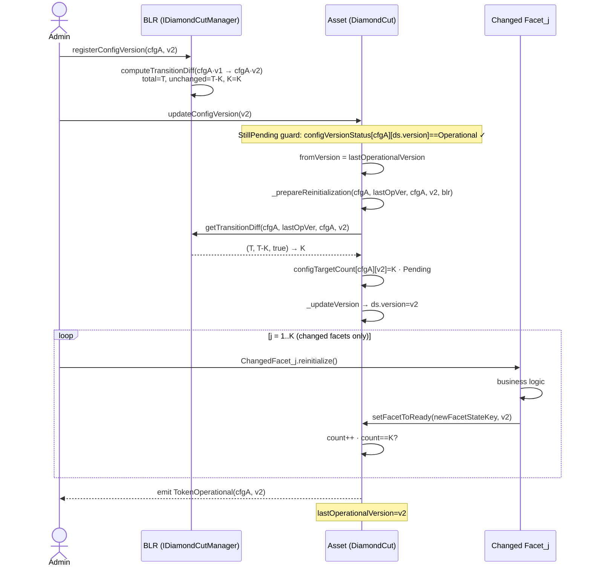
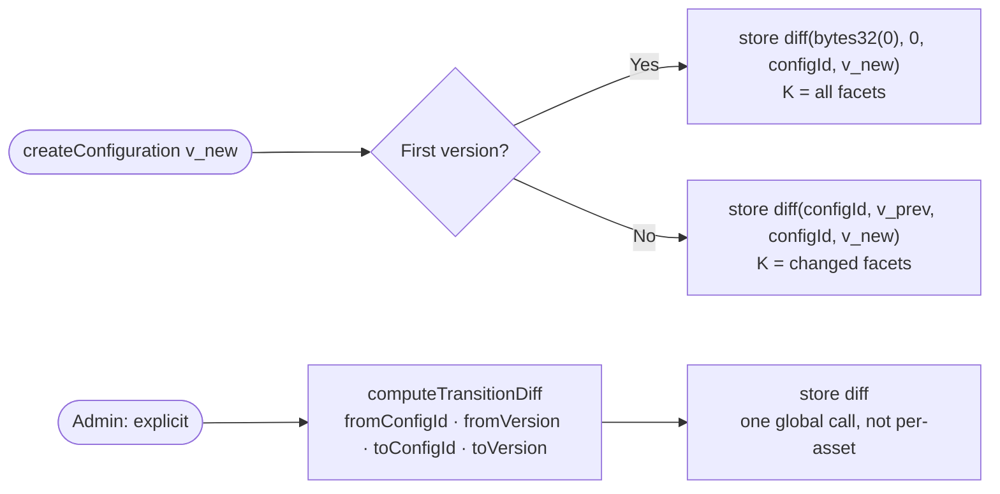

# ADR-002: Counter-Based Auto-Operational Activation

**Status**: Proposed (PoC)
**Date**: 2026-05-05
**Branch**: poc/BBND-auto-operational-counter

---

## Context

After a diamond initialization or upgrade, each participating facet calls `setFacetToReady`. Once all relevant facets are ready the token must transition to _operational_.

### Prior approaches

| Approach                    | Problem                                                                            |
| --------------------------- | ---------------------------------------------------------------------------------- |
| `setOperationalStatus`      | Extra mandatory tx after last facet; O(N) gas per batch                            |
| `setConfigTargetCount` (v1) | Moved the extra call to the start; one call per asset; assumes sequential upgrades |

---

## Options Evaluated

| Option                                                 | Gas             | Operator calls                         | Verdict                  |
| ------------------------------------------------------ | --------------- | -------------------------------------- | ------------------------ |
| Keep `setOperationalStatus`                            | O(N) per batch  | 1 per upgrade                          | ❌                       |
| `setConfigTargetCount` per asset                       | O(1)            | 1 per asset                            | ❌                       |
| Lazy O(N) scan on first `initialize`                   | O(N) first call | 0                                      | ❌ unbounded             |
| BLR diff vs `v_{n-1}` only                             | O(1)            | 0 sequential                           | ❌ breaks non-sequential |
| **BLR pre-computed diff + `_prepareReinitialization`** | O(1) per facet  | 0 sequential / 1 global non-sequential | ✅                       |

The selected option is the only one that eliminates operator calls for sequential upgrades while remaining O(1) per facet in all scenarios.

---

## Decision

`updateConfigVersion`, `updateConfig`, and `updateResolver` — the three `IDiamondCut` methods that modify asset configuration — all delegate to a shared `_prepareReinitialization`. This queries the BLR once, stores K, and atomically disables the asset. Every subsequent `initialize`/`reinitialize` is then homogeneous: increment, check, activate if complete.

### Initialization lifecycle



### Re-initialization lifecycle



```
_prepareReinitialization(fromConfigId, fromVersion, toConfigId, toVersion):
  1. BLR.getTransitionDiff(fromConfigId, fromVersion, toConfigId, toVersion)
       → (totalFacets, unchangedFacets, isRegistered)
  2. if !isRegistered → revert TransitionDiffNotRegistered (typed error)
  3. if configVersionStatus[toConfigId][toVersion] == Pending
       → revert AlreadyPendingReinitialization (typed error)
  4. K = totalFacets − unchangedFacets
  5. if K == 0 → lastOperationalVersion = toVersion,
                 configVersionStatus[toConfigId][toVersion] = Operational,
                 emit TokenOperational, return
  6. configTargetCount[toConfigId][toVersion] = K
  7. configInitializedCount[toConfigId][toVersion] = 0
  8. configVersionStatus[toConfigId][toVersion] = Pending
```

`lastOperationalVersion` and the current `resolverProxyConfigurationId` (read from
`ResolverProxyStorage` before update) are the only data the asset contributes to the BLR
query. The BLR holds all configuration knowledge; the asset holds only its own version history.

The entry points differ only in how they resolve `(fromConfigId, fromVersion, toConfigId, toVersion)`:

| Entry point                   | fromConfigId     | fromVersion              | toConfigId       | toVersion  | Scenario                  |
| ----------------------------- | ---------------- | ------------------------ | ---------------- | ---------- | ------------------------- |
| `constructor` / `_initialize` | `bytes32(0)`     | `0`                      | configId         | version    | Fresh deploy              |
| `updateConfigVersion`         | current configId | `lastOperationalVersion` | current configId | newVersion | Version upgrade           |
| `updateConfig`                | current configId | `lastOperationalVersion` | newConfigId      | newVersion | Config migration (A→B)    |
| `updateResolver`              | `bytes32(0)`†    | `0`†                     | newConfigId      | newVersion | Resolver + config change† |

> † `updateResolver` changes the BLR. The new resolver has no knowledge of the old `configId`/version, so the transition is treated as a fresh deploy: `fromConfigId = bytes32(0)`, `fromVersion = 0`. Cross-resolver diff registration is not supported in this design.

---

## Storage Changes

**`InitializerDataStorage`** — per deployed asset:

```solidity
uint256 lastOperationalVersion;  // NEW: version last emitted as TokenOperational

// Existing mappings — layout preserved. Facet state keys are now context-scoped:
// facetStateKey   = keccak256(abi.encodePacked(resolver, configId, facetId, facetVersion))
// facetContextKey = keccak256(abi.encodePacked(resolver, configId, facetId))
mapping(bytes32 facetStateKey   => uint256) facetVersionStatus;   // existing (key scheme change)
mapping(bytes32 facetContextKey => uint256) facetLastVersion;     // existing (key scheme change)
// encoding: 0=uninitialised · 1=Operational · type(uint256).max=Pending · 2..max-1=resume index+1
mapping(bytes32 configId => mapping(uint256 version => uint256)) configVersionStatus;
mapping(bytes32 configId => mapping(uint256 version => uint256)) configInitializedCount;
mapping(bytes32 configId => mapping(uint256 version => uint256)) configTargetCount;
```

**`DiamondCutManagerStorage`**:

```solidity
// transitionHash = keccak256(fromConfigId, fromVersion, toConfigId, toVersion)
mapping(bytes32 transitionHash => uint256 totalFacets)     transitionTotalCount;
mapping(bytes32 transitionHash => uint256 unchangedFacets) transitionUnchangedCount;
mapping(bytes32 transitionHash => bool registered)         transitionRegistered;
```

**`IDiamondCutManager`**:

```solidity
function computeTransitionDiff(
  bytes32 fromConfigId,
  uint256 fromVersion,
  bytes32 toConfigId,
  uint256 toVersion
) external;

function getTransitionDiff(
  bytes32 fromConfigId,
  uint256 fromVersion,
  bytes32 toConfigId,
  uint256 toVersion
) external view returns (uint256 totalFacets, uint256 unchangedFacets, bool isRegistered);
```

**`IDiamondCut`** — no signature change. Existing methods are the hook points:

```solidity
function updateConfigVersion(uint256 _newVersion) external;
function updateConfig(bytes32 _newConfigId, uint256 _newVersion) external;
function updateResolver(IBusinessLogicResolver _newResolver, bytes32 _newConfigId, uint256 _newVersion) external;
```

---

## Scenarios

### Happy path — sequence diagrams

#### Fresh deploy



#### Sequential upgrade (v1 → v2, K changed facets)



---

### Fresh deploy

```
[Pre-condition] BLR.registerConfigVersion(configId, v1)
  → auto: computeTransitionDiff(bytes32(0), 0, configId, v1) → stored

constructor(_resolver, configId, v1, _rbac)
  → _initialize → _prepareReinitialization(bytes32(0), 0, configId, v1)
  → getTransitionDiff(bytes32(0), 0, configId, v1) = (N, 0, true) → K=N
  → Pending

initialize × N [each facet: onlyFacetNotRegistered · onlyFacetNotReady]
  → setFacetToReady → facetLastVersion[facetId] = facetVersion · initializedCount++
  → initializedCount == N → TokenOperational · lastOperationalVersion = v1
```

### Sequential upgrade — implicit (v1 → v2, only FacetB changed)

```
[Step 0] BLR.registerConfigVersion(configId, v2)
  → auto: computeTransitionDiff(configId, v1, configId, v2) → stored

updateConfigVersion(configId, v2)
  → _prepareReinitialization(configId, v1, configId, v2)
  → getTransitionDiff(configId, v1, configId, v2) = (N, N-1, true) → K=1
  → Pending

FacetB.reinitialize() [onlyFacetRegistered · onlyFacetNotReady]
  → setFacetToReady → facetLastVersion[FacetB] = v2 · initializedCount++
  → initializedCount == 1 → TokenOperational · lastOperationalVersion = v2
```

### Sequential upgrade — no changes (v1 → v2, no facet changed)

```
[Step 0] BLR.registerConfigVersion(configId, v2)
  → auto: computeTransitionDiff(configId, v1, configId, v2) → stored

updateConfigVersion(configId, v2)
  → _prepareReinitialization(configId, v1, configId, v2)
  → getTransitionDiff(configId, v1, configId, v2) = (N, N, true) → K=0
  → immediate: TokenOperational · lastOperationalVersion = v2
```

### Non-sequential upgrade — explicit (v1 → v5)

```
Criterion: asset.lastOperationalVersion < BLR.latestVersion − 1
  → diff (v1, v5) not auto-computed → operator must register it explicitly

[Step 0] BLR.registerConfigVersions(configId, v2..v5)          ← auto-diffs v1→v2, v2→v3... stored
[Step 1, admin, once, global] BLR.computeTransitionDiff(configId, v1, configId, v5) ← explicit cross-version diff

updateConfigVersion(configId, v5)
  → _prepareReinitialization(configId, v1, configId, v5)
  → getTransitionDiff(configId, v1, configId, v5) = (N, N-K, true) → K
  → Pending

reinitialize × K [onlyFacetRegistered · onlyFacetNotReady]
  → setFacetToReady × K → initializedCount == K
  → TokenOperational · lastOperationalVersion = v5
```

---

## Consequences

|     |                                                                                                              |
| --- | ------------------------------------------------------------------------------------------------------------ |
| ✅  | Zero operator calls for sequential upgrades                                                                  |
| ✅  | Non-sequential: one global admin call, not per-asset                                                         |
| ✅  | O(1) gas per `initialize`/`reinitialize`                                                                     |
| ✅  | Asset explicitly disabled during update window                                                               |
| ✅  | Three triggers, one homogeneous re-initialization flow                                                       |
| ✅  | Facet initialization order is not managed by the protocol — handled by facet business logic                  |
| ✅  | `setConfigTargetCount` eliminated — `configTargetCount` is written exclusively by `_prepareReinitialization` |
| ⚠️  | `_prepareReinitialization`: +1 cross-contract SLOAD (~3–5k gas, once per asset per version)                  |
| ⚠️  | Non-sequential: `computeTransitionDiff` must be called before upgrade campaign                               |
| ✅  | Config migration (A→B): facet state is context-scoped — version downgrades supported                         |
| ⚠️  | `updateResolver` always triggers full re-initialization (all facets, new resolver context)                   |

---

## Annexes

### Annex A — Gas Analysis

| Operation                                        | Gas cold (approx.) | Gas warm (approx.) |
| ------------------------------------------------ | ------------------ | ------------------ |
| `_prepareReinitialization` (BLR read)            | ~5k                | ~2k                |
| `initialize`/`reinitialize` (non-final)          | ~46k               | ~22k               |
| `initialize`/`reinitialize` (final — activation) | ~70k               | ~35k               |
| `setOperationalStatus` current (10-facet batch)  | ~60k–120k          | —                  |
| `computeTransitionDiff` (N=50 facets)            | ~300k              | —                  |

Benchmark: `gasBenchmarkInitializer.test.ts` validates N = {1, 5, 10, 25, 50, 100} against Hedera's 7.5M practical gas limit.

**Theoretical maximum for `computeTransitionDiff` (O(N)):**

| N facets | Gas (approx.) | % of 7.5M limit                       |
| -------- | ------------- | ------------------------------------- |
| 100      | ~600k         | 8%                                    |
| 250      | ~1.5M         | 20%                                   |
| 500      | ~3.0M         | 40% ← recommended operational ceiling |
| 1,250    | ~7.5M         | 100% — theoretical hard limit         |

Recommended ceiling: **500 facets per config**. To be validated and updated after benchmark implementation.

### Annex B — `getTransitionDiff` Return Cases

| Call                                                                  | Returns                    | Scenario                    |
| --------------------------------------------------------------------- | -------------------------- | --------------------------- |
| `(bytes32(0), 0, configId, v1)`                                       | `(N, 0, true)`             | Fresh deploy — all facets   |
| `(fromConfigId, fromVersion, toConfigId, toVersion)` — not registered | `(0, 0, false)`            | Transition not pre-computed |
| `(fromConfigId, fromVersion, toConfigId, toVersion)` — registered     | `(total, unchanged, true)` | K = total − unchanged       |

> Constraint: already-initialized facet versions cannot be re-initialized.

### Annex C — BLR Diff Computation



`computeTransitionDiff(fromConfigId, fromVersion, toConfigId, toVersion)`:

- `from == 0`: K = total facets in `to`.
- `from > 0`: iterate facets in `to`; new or version-changed → K++; unchanged → skip.

Sequential registration auto-calls this for `(configId, latestVersion, configId, newVersion)` (same config).

**Implicit vs explicit criterion:**

| Case                      | Condition                                                   | Diff source                                                                                                                        |
| ------------------------- | ----------------------------------------------------------- | ---------------------------------------------------------------------------------------------------------------------------------- |
| Implicit (sequential)     | fromConfigId == toConfigId, `from == BLR.latestVersion − 1` | Auto-computed on `registerConfigVersion`                                                                                           |
| Explicit (non-sequential) | fromConfigId == toConfigId, `from < BLR.latestVersion − 1`  | Admin calls `computeTransitionDiff(fromConfigId, fromVersion, toConfigId, toVersion)` before `update*`                             |
| Explicit (cross-config)   | fromConfigId != toConfigId                                  | Admin must register diff between configs explicitly with `computeTransitionDiff(fromConfigId, fromVersion, toConfigId, toVersion)` |

If `updateConfigVersion` is called without the explicit diff registered → `_prepareReinitialization` reverts (step 2: `!isRegistered`).

### Annex D — Cross-Config Transitions (A ↔ B)

Config migration uses `updateConfig(newConfigId, v1)` or `updateResolver(newResolver, newConfigId, newVersion)`.

**`updateConfig` (same resolver, different configId):**

- `fromConfigId` = current configId (A), `toConfigId` = new configId (B).
- The BLR stores data per configId separately. A diff for `(A, lastOpVer, B, v1)` is NOT auto-computed.
- **Admin must register it explicitly**: `computeTransitionDiff(A, lastOpVer, B, v1)` before `updateConfig`.
- Same-configId transitions are auto-computed. Cross-config transitions are always explicit.

**`updateResolver` (different resolver):**

- The new resolver has NO knowledge of the old configId/versions.
- Always treated as fresh deploy: `fromConfigId = bytes32(0)`, `fromVersion = 0`.
- The counter starts from scratch for the new resolver. All facets in the target config must initialize.

**Shared facets across configs:**

- A facet F at version v initialized in config A has `facetVersionStatus[keccak(resolver, A, F, v)] = 1`.
- In config B, the key is `keccak(resolver, B, F, v)` — a different key, status = 0.
- If the BLR reports F as "unchanged" between A and B (same version) → F is NOT in K → no reinitialize needed.
- If the BLR reports F as "changed" (different version) → F is in K → F must reinitialize in B's context.
- Version downgrades (F at v2 in A, at v1 in B) are supported: key in B context is fresh regardless of version.

### Annex E — Modifier Guards

Four modifiers in `InitializerModifiers.sol` gate the initialization lifecycle:

| Modifier                                     | Check                                                                           | Used on                       |
| -------------------------------------------- | ------------------------------------------------------------------------------- | ----------------------------- |
| `onlyOperational`                            | `configVersionStatus[configId][version] == Operational`                         | All facet business logic      |
| `onlyFacetNotReady(facetId)`                 | `facetVersionStatus[stateKey(resolver,configId,facetId,ver)] == 0`              | `initialize` / `reinitialize` |
| `onlyFacetRegistered(facetId, fromVersions)` | `facetLastVersion[ctxKey(resolver,configId,facetId)] != 0` and in accepted list | `reinitialize` only           |
| `onlyFacetNotRegistered(facetId)`            | `facetLastVersion[ctxKey(resolver,configId,facetId)] == 0`                      | `initialize` only             |

**facetStateKey = `keccak256(resolver, configId, facetId, facetVersion)`**

`facetVersion` is resolved from the BLR for `(configId, configVersion, facetId)`. The key includes the resolver address and configId so initialization state is scoped to a specific deployment context. Consequences:

- Same facet at same version in a different configId or resolver → different key → requires re-initialization.
- Facet version change in BLR → different key → requires re-initialization.
- Version "downgrade" in cross-config migration (e.g. Transfer v2→v1) → different key in new config context → can re-initialize.
- Resolver change → all facets have fresh keys under new resolver → full re-initialization required.

**`facetLastVersion` write mechanism**

`setFacetToReady` is the single write point for facet initialization state. Called at the end of each `initialize`/`reinitialize`:

```
setFacetToReady(facetId, facetVersion):
  1. facetContextKey = keccak256(resolver, configId, facetId)          ← from proxy storage
     facetStateKey   = keccak256(resolver, configId, facetId, facetVersion)
     facetLastVersion[facetContextKey]  = facetVersion    ← enables onlyFacetRegistered
     facetVersionStatus[facetStateKey]  = 1               ← marks this version as Ready
  2. configInitializedCount[configId][versionId]++   ← configId + versionId from proxy storage
  3. if configInitializedCount[configId][versionId] == configTargetCount[configId][versionId]
       → lastOperationalVersion = versionId
       → configVersionStatus[configId][versionId] = Operational
       → emit TokenOperational
```

`facetVersion` is resolved by `onlyFacetNotReady` via BLR at call time — not stored locally (see no-cache decision below).

**No local caching of `facetVersion` in `onlyFacetNotReady`**

`onlyFacetNotReady` calls the BLR cross-contract on every `initialize`/`reinitialize`. An alternative would be to cache `facetVersion` per facet during `_prepareReinitialization`.

Gas comparison (K facets):

| Approach                       | Cost            |
| ------------------------------ | --------------- |
| Cross-contract call (BLR warm) | ~200 gas × K    |
| SSTORE to cache + local SLOAD  | ~20,100 gas × K |

Caching costs ~100× more for any K. BLR address is warm in initialization transactions. Decision: no cache.

### Annex G — `setConfigTargetCount` Eliminated

`setConfigTargetCount` is removed from `IInitializer`. `configTargetCount` is an internal field of `InitializerDataStorage` that is written exclusively by `_prepareReinitialization`. No external or public function exposes a setter.

This eliminates the entire class of race conditions where an external caller could corrupt K after `_prepareReinitialization` computed it from the BLR diff. The only valid write path is: `update*` (DiamondCut) or `_initialize` (ResolverProxy) → `_prepareReinitialization` → `configTargetCount[toConfigId][toVersion] = K`.

### Annex H — Design Restrictions and Notes

#### H.1 — `updateResolver` Fresh Deploy Semantics

`updateResolver` changes the BLR contract. The new resolver has no data about the old configId. Therefore `_prepareReinitialization` always receives `fromConfigId = bytes32(0), fromVersion = 0`. This means:

- The counter starts at K = all facets in the new config (full fresh-deploy semantics).
- With the composite key `keccak256(resolver, configId, facetId, facetVersion)`, a resolver change produces entirely new keys for every facet — all previous `facetVersionStatus` and `facetLastVersion` entries are unreachable from the new context. No "already Ready" blocking occurs: every facet must reinitialize.
- Cross-resolver diff registration is not supported in this design.

#### H.2 — Reentrancy Window

The entry points MUST call `_prepareReinitialization` **before** the `_update*` calls (order: prepare → update):

```
1. Capture previousConfigId = ds.resolverProxyConfigurationId
2. Capture previousVersion  = initializer.lastOperationalVersion
3. _prepareReinitialization(previousConfigId, previousVersion, toConfigId, toVersion, BLR)
4. _updateVersion / _updateConfigId / _updateResolver
```

**Why this order matters**: if `_updateVersion` runs first, the proxy already points to the new version while `configTargetCount` is still 0. A reentrant `setFacetToReady` call in the same tx (e.g. from a malicious facet `initialize`) would trigger `_tryAutoActivate` which reads `configTargetCount[newVersion] = 0` and returns without activating — but it also writes `facetVersionStatus[newStateKey] = 1`. When `_prepareReinitialization` then runs, it cannot reset that flag; `onlyFacetNotReady` will permanently block that facet from re-initializing.

**Risk**: Low — requires reentrancy inside an `onlyRole(DEFAULT_ADMIN_ROLE)` function.

**`updateResolver` exception** — `ds.resolver` still points to the old BLR when `_prepareReinitialization` runs. The new resolver MUST be passed explicitly:

```
1. _prepareReinitialization(bytes32(0), 0, newConfigId, newVersion,
       IDiamondCutManager(address(newResolver)))   ← new resolver, not ds.resolver
2. _updateResolver(ds, newResolver, newConfigId, newVersion)
```

#### H.3 — `fromVersion == 0 || fromVersion < toVersion` Validation

`_computeTransitionDiff` must validate that `fromVersion < toVersion` when `fromVersion > 0`. Downgrades (toVersion < fromVersion) are undefined behaviour. The revert uses the existing `ResolverProxyConfigurationNoRegistered(toConfigId, toVersion)`.

#### H.4 — `targetVersion` Storage Field Not Required

The `targetVersion` field originally proposed for `InitializerDataStorage` is not consumed by any modifier or activation path. `_tryAutoActivate` reads `configTargetCount[configId][versionId]` where `versionId` is the current proxy version. The target version is implicit from the proxy storage. Implementation MAY omit this field.

#### H.5 — `configTargetCount` Write Invariant

`configTargetCount[toConfigId][toVersion]` is written only once per `(toConfigId, toVersion)` pair — during `_prepareReinitialization`. A second call to `_prepareReinitialization` for the same pair is impossible because the `StillPending` guard at the `update*` entry points reverts if `configVersionStatus == Pending`. This guarantees K is stable for the entire lifetime of the initialization window.

#### H.6 — `setOperationalStatus` Incompatibility with Composite Key

`setOperationalStatus` (the legacy batch activation mechanism) iterates all facets in the current config and checks `facetVersionStatus[stateKey]` for each. With the composite key scheme, "unchanged" facets in a cross-config migration have `facetVersionStatus[keccak(resolver, newConfigId, facetId, facetVersion)] = 0` — they were never initialized in the new context. `setOperationalStatus` would find them not ready and would never activate the config, even after all K changed facets have initialized correctly.

**Consequence**: `setOperationalStatus` is incompatible with cross-config migrations (`updateConfig`, `updateResolver`) after this ADR. It remains correct for same-config version upgrades (`updateConfigVersion`) where all facets in the current config have their state keys set.

**Resolution in this ADR**: Auto-activation via the counter in `_tryAutoActivate` replaces `setOperationalStatus` for all paths. `setOperationalStatus` is retained as the base for the future `forceActivate` admin mechanism (see Pending Work) but MUST NOT be called on a config that contains unchanged cross-config facets.

#### H.7 — Unchanged Facets in Cross-Config Migration — Protocol Assumption

When `computeTransitionDiff` classifies a facet as "unchanged" (same version in from and to), that facet is excluded from K. The counter mechanism assumes it will not call `initialize` or `reinitialize` in the new config context.

With the composite key, an unchanged facet's keys in the new context are fresh (status = 0). The protocol guards (`onlyFacetNotRegistered`, `onlyFacetNotReady`) would allow it to initialize. If it does:

- Its business logic runs again (potentially idempotent, potentially not).
- The counter increments past K.
- `_tryAutoActivate` uses `>=` so it fires again, emitting a duplicate `TokenOperational` event.

**Scope**: Limited to operator error or a malicious facet calling its own `initialize` outside the upgrade script. The contract cannot distinguish intent. `TokenOperational` duplication is observable off-chain but does not corrupt on-chain state (status is already 1).

**Mitigation boundary**: Enforced at the upgrade script level — unchanged facets MUST NOT be triggered after a cross-config migration. On-chain enforcement (pre-setting unchanged facets' state keys during `_prepareReinitialization`) would be O(N) and contradicts the O(1) gas goal.

---

## Pending Work

Items identified during PoC but deferred to subsequent iterations.

| Item                                                                                                                           | Phase          | Target file                           |
| ------------------------------------------------------------------------------------------------------------------------------ | -------------- | ------------------------------------- |
| Guard `StillPending` at `updateConfigVersion` / `updateConfig` / `updateResolver` — revert if current state is not Operational | This PoC       | `DiamondCut.sol` + `IInitializer.sol` |
| `forceActivate(configId, version)` — admin-only emergency activation, bypasses counter                                         | Next iteration | New `IInitializerAdminFacet`          |
| External read API — `isOperational`, `getInitializationProgress`, `isFacetReady`                                               | Next iteration | New `IInitializerReader` interface    |
| Cross-resolver validation protocol — verify facet compatibility between old and new BLR                                        | Future         | BLR + new interface                   |

---

## References

- [EIP-2535 Diamond Standard](https://eips.ethereum.org/EIPS/eip-2535)
- `contracts/domain/core/InitializerStorageWrapper.sol`
- `contracts/infrastructure/diamond/DiamondCutManagerWrapper.sol`
- `contracts/facets/initializer/IInitializer.sol`
- `test/contracts/unit/layer_1/gasBenchmarkInitializer/gasBenchmarkInitializer.test.ts`
- Slack discussion: BBND-auto-operational-counter, 2026-05 (internal)
