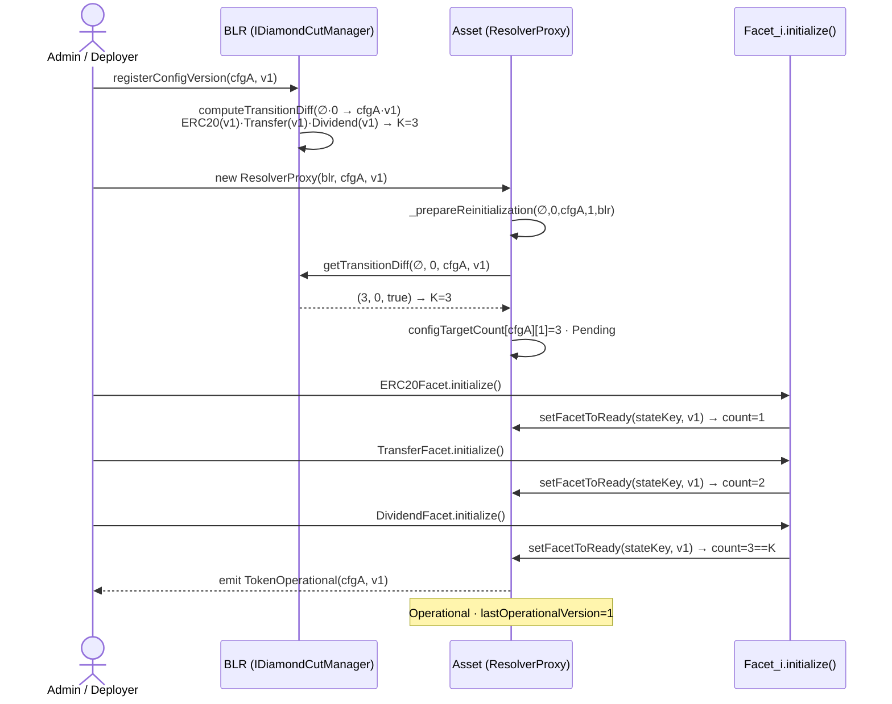
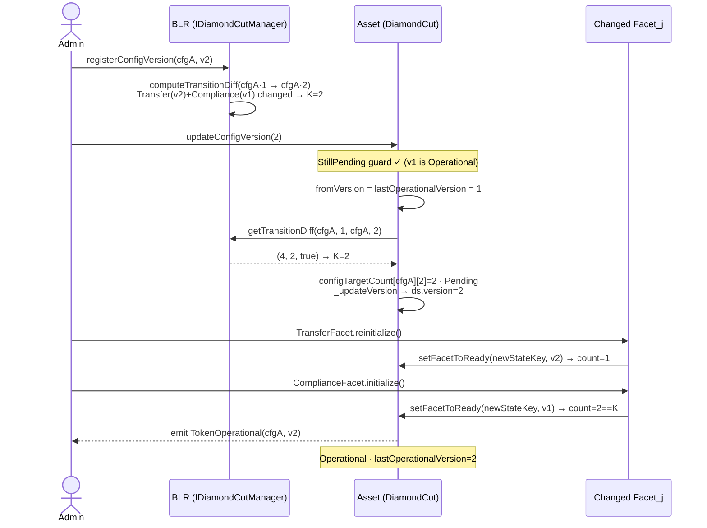
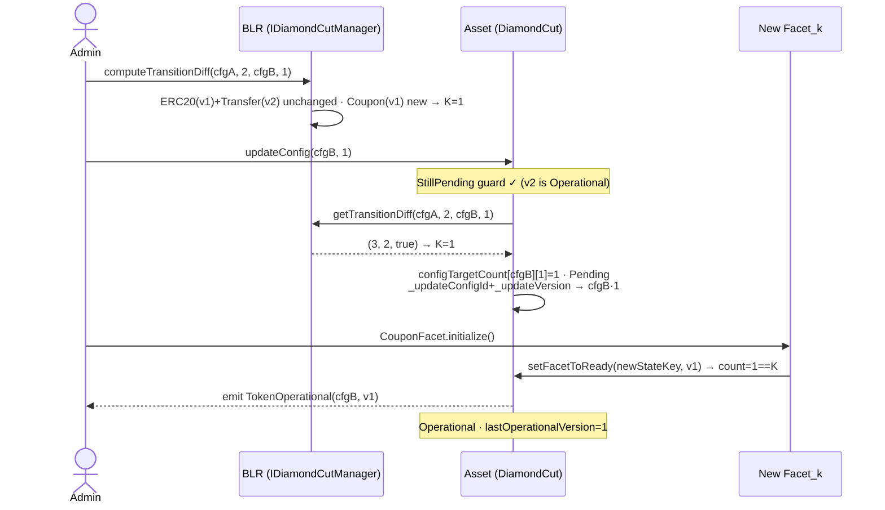

# SIM-002: Counter-Based Auto-Operational — Simulation & Validation

> **ADR**: `ADR-002-counter-based-auto-operational.md`
> **Branch**: `poc/BBND-auto-operational-counter`

---

## Setup

### Facet Registry (BLR)

| FacetId           | v1  | v2  |
| ----------------- | --- | --- |
| `ERC20Facet`      | ✓   | ✓   |
| `TransferFacet`   | ✓   | ✓   |
| `DividendFacet`   | ✓   | —   |
| `ComplianceFacet` | ✓   | —   |
| `CouponFacet`     | ✓   | —   |
| `GovernanceFacet` | ✓   | —   |

### Configuration Map

| Config                | Version | Facets                                                     | Notes                                                                 |
| --------------------- | ------- | ---------------------------------------------------------- | --------------------------------------------------------------------- |
| **Config A** (`cfgA`) | v1      | ERC20(v1) · Transfer(v1) · Dividend(v1)                    | Equity base                                                           |
| **Config A** (`cfgA`) | v2      | ERC20(v1) · Transfer(v2) · Dividend(v1) · Compliance(v1)   | Transfer upgraded + Compliance added                                  |
| **Config B** (`cfgB`) | v1      | ERC20(v1) · Transfer(v2) · Coupon(v1)                      | Bond — shares ERC20(v1)+Transfer(v2) with A-v2                        |
| **Config C** (`cfgC`) | v1      | ERC20(v2) · Transfer(v2) · Governance(v1) · Compliance(v1) | Hybrid — ERC20 upgraded, shares Transfer(v2)+Compliance(v1) with A-v2 |

### Pre-computed Transition Diffs (BLR storage)

| Hash key           | from  | to   | totalFacets | unchangedFacets | K     |
| ------------------ | ----- | ---- | ----------- | --------------- | ----- |
| `H(∅,0,cfgA,1)`    | fresh | A-v1 | 3           | 0               | **3** |
| `H(cfgA,1,cfgA,2)` | A-v1  | A-v2 | 4           | 2               | **2** |
| `H(cfgA,2,cfgB,1)` | A-v2  | B-v1 | 3           | 2               | **1** |
| `H(cfgA,2,cfgC,1)` | A-v2  | C-v1 | 4           | 2               | **2** |

Diffs `H(∅,0,A,1)` and `H(A,1,A,2)` are **auto-computed** on `registerConfigVersion`.
Diffs `H(A,2,B,1)` and `H(A,2,C,1)` require **explicit** `computeTransitionDiff` call (cross-config).

---

## Happy Path Overview

### Fresh deploy + initialization



### Sequential upgrade (A-v1 → A-v2, K=2)



### Config migration (A-v2 → B-v1, K=1)



---

# Version 1 — Explanatory Simulation

> **Key notation** used throughout this section:
> `ctx(F)` = `keccak256(resolver, configId, F)` — facet context key
> `state(F,v)` = `keccak256(resolver, configId, F, v)` — facet state key

## Scenario 1 — Fresh Deploy + Initialization (Config A v1)

### Step 0 — BLR registers Config A v1

```
BLR.registerConfigVersion(cfgA, v1)
  → _activateConfiguration(cfgA, v1) fires
  → prevVersion = 0 (first version for cfgA)
  → auto: computeTransitionDiff(∅, 0, cfgA, v1)
       → from=0: totalFacets = 3 (ERC20, Transfer, Dividend)
       → stored: H(∅,0,cfgA,1) = (3, 0, true)
  → latestVersion[cfgA] = 1
```

### Step 1 — Deploy asset (constructor → `_initialize`)

```
constructor(blr, cfgA, 1, rbac)
  → ResolverProxyStorage written: configId=cfgA, version=1, resolver=blr
  → _prepareReinitialization(∅, 0, cfgA, 1, blr)
       getTransitionDiff(∅, 0, cfgA, 1) → (3, 0, true)  ← K=3
       configVersionStatus[cfgA][1] = type(uint256).max  (Pending)
       configTargetCount[cfgA][1]   = 3
       configInitializedCount[cfgA][1] = 0
```

**Asset state after deploy:**

| Field                             | Value   |
| --------------------------------- | ------- |
| `ds.configId`                     | cfgA    |
| `ds.version`                      | 1       |
| `configVersionStatus[cfgA][1]`    | Pending |
| `configTargetCount[cfgA][1]`      | 3       |
| `configInitializedCount[cfgA][1]` | 0       |
| `lastOperationalVersion`          | 0       |

### Step 2 — ERC20Facet.initialize()

```
onlyFacetNotRegistered:  facetLastVersion[ctx(ERC20)] == 0        ✓
onlyFacetNotReady:       facetVersionStatus[state(ERC20,v1)] == 0 ✓
→ business logic executes
setFacetToReady(ERC20, v1):
  facetLastVersion[ctx(ERC20)]         = v1
  facetVersionStatus[state(ERC20,v1)]  = 1
  configInitializedCount[cfgA][1] = 1   (1 < 3 → no activation)
```

### Step 3 — TransferFacet.initialize()

```
→ setFacetToReady(Transfer, v1):
  facetLastVersion[ctx(Transfer)]        = v1
  facetVersionStatus[state(Transfer,v1)] = 1
  configInitializedCount[cfgA][1] = 2   (2 < 3 → no activation)
```

### Step 4 — DividendFacet.initialize() ← activation fires

```
→ setFacetToReady(Dividend, v1):
  facetLastVersion[ctx(Dividend)]        = v1
  facetVersionStatus[state(Dividend,v1)] = 1
  configInitializedCount[cfgA][1] = 3   (3 == 3 → ACTIVATE)
  configVersionStatus[cfgA][1]   = 1  (Operational)
  lastOperationalVersion         = 1
  emit TokenOperational(cfgA, 1)
```

**Asset state — Operational:**

| Field                          | Value                                             |
| ------------------------------ | ------------------------------------------------- |
| `configVersionStatus[cfgA][1]` | Operational (1)                                   |
| `lastOperationalVersion`       | 1                                                 |
| `facetLastVersion`             | ctx(ERC20)=v1, ctx(Transfer)=v1, ctx(Dividend)=v1 |

---

## Scenario 2 — Version Upgrade (Config A v1 → v2)

### Step 0 — BLR registers Config A v2

```
BLR.registerConfigVersion(cfgA, v2)
  → prevVersion = 1
  → auto: computeTransitionDiff(cfgA, 1, cfgA, 2)
       iterate facets in A-v2:
         ERC20(v1)      → A-v1 had ERC20(v1)      → same → unchanged++
         Transfer(v2)   → A-v1 had Transfer(v1)   → changed → K++
         Dividend(v1)   → A-v1 had Dividend(v1)   → same → unchanged++
         Compliance(v1) → NOT in A-v1             → new → K++
       totalFacets=4, unchangedFacets=2, K=2
  → stored: H(cfgA,1,cfgA,2) = (4, 2, true)
```

### Step 1 — Operator calls `updateConfigVersion(2)`

```
DiamondCut.updateConfigVersion(2):
  fromVersion = lastOperationalVersion = 1
  _prepareReinitialization(cfgA, 1, cfgA, 2, blr)
    getTransitionDiff(cfgA, 1, cfgA, 2) → (4, 2, true)  ← K=2
    configVersionStatus[cfgA][2] = Pending
    configTargetCount[cfgA][2]   = 2
    configInitializedCount[cfgA][2] = 0
  _updateVersion(ds, 2)  → ds.version = 2
```

Asset is now **Pending** on A-v2. Business logic guarded by `onlyOperational` reverts.

### Step 2 — TransferFacet.reinitialize()

```
onlyFacetRegistered(Transfer, [v1]):  facetLastVersion[ctx(Transfer)]=v1 ✓
onlyFacetNotReady:                    facetVersionStatus[state(Transfer,v2)]==0 ✓  (v2 never initialized in cfgA context)
→ setFacetToReady(Transfer, v2):
  facetLastVersion[ctx(Transfer)]        = v2   (updated)
  facetVersionStatus[state(Transfer,v2)] = 1
  configInitializedCount[cfgA][2]  = 1   (1 < 2 → no activation)
```

### Step 3 — ComplianceFacet.initialize() ← activation fires

```
onlyFacetNotRegistered:  facetLastVersion[ctx(Compliance)] == 0         ✓
onlyFacetNotReady:       facetVersionStatus[state(Compliance,v1)] == 0  ✓
→ setFacetToReady(Compliance, v1):
  facetLastVersion[ctx(Compliance)]        = v1
  facetVersionStatus[state(Compliance,v1)] = 1
  configInitializedCount[cfgA][2] = 2   (2 == 2 → ACTIVATE)
  configVersionStatus[cfgA][2]   = 1
  lastOperationalVersion         = 2
  emit TokenOperational(cfgA, 2)
```

**Asset state — Operational on A-v2:**

| Field                          | Value                                                                 |
| ------------------------------ | --------------------------------------------------------------------- |
| `configVersionStatus[cfgA][2]` | Operational                                                           |
| `lastOperationalVersion`       | 2                                                                     |
| `facetLastVersion`             | ctx(ERC20)=v1, ctx(Transfer)=v2, ctx(Dividend)=v1, ctx(Compliance)=v1 |

---

## Scenario 3 — Config Migration (Config A v2 → Config B v1)

Config B has the same BLR but a different configId. ERC20(v1) and Transfer(v2) are shared.

### Step 0 — Admin pre-registers cross-config diff (explicit, one-time global call)

```
admin: BLR.computeTransitionDiff(cfgA, 2, cfgB, 1)
  iterate facets in B-v1:
    ERC20(v1)  → A-v2 had ERC20(v1)  → same → unchanged++
    Transfer(v2) → A-v2 had Transfer(v2) → same → unchanged++
    Coupon(v1) → NOT in A-v2          → new → K++
  totalFacets=3, unchangedFacets=2, K=1
  stored: H(cfgA,2,cfgB,1) = (3, 2, true)
```

### Step 1 — Operator calls `updateConfig(cfgB, 1)`

```
DiamondCut.updateConfig(cfgB, 1):
  currentConfigId = cfgA
  fromVersion     = lastOperationalVersion = 2
  _prepareReinitialization(cfgA, 2, cfgB, 1, blr)
    getTransitionDiff(cfgA, 2, cfgB, 1) → (3, 2, true)  ← K=1
    configVersionStatus[cfgB][1] = Pending
    configTargetCount[cfgB][1]   = 1
    configInitializedCount[cfgB][1] = 0
  _updateConfigId(ds, cfgB)
  _updateVersion(ds, 1)
```

### Step 2 — CouponFacet.initialize() ← activation fires immediately

```
onlyFacetNotRegistered:  facetLastVersion[ctx(Coupon)] == 0         ✓  (cfgB context, fresh)
onlyFacetNotReady:       facetVersionStatus[state(Coupon,v1)] == 0  ✓
→ setFacetToReady(Coupon, v1):
  facetLastVersion[ctx(Coupon)]        = v1
  facetVersionStatus[state(Coupon,v1)] = 1
  configInitializedCount[cfgB][1] = 1   (1 == 1 → ACTIVATE)
  configVersionStatus[cfgB][1]   = 1
  lastOperationalVersion         = 1
  emit TokenOperational(cfgB, 1)
```

**Asset state — Operational on B-v1:**

| Field                          | Value                                                                   |
| ------------------------------ | ----------------------------------------------------------------------- |
| `ds.configId`                  | cfgB                                                                    |
| `ds.version`                   | 1                                                                       |
| `configVersionStatus[cfgB][1]` | Operational                                                             |
| `lastOperationalVersion`       | 1                                                                       |
| `facetLastVersion`             | ctx(ERC20 in cfgA)=v1, ctx(Transfer in cfgA)=v2, ctx(Coupon in cfgB)=v1 |

Note: ERC20 and Transfer are "unchanged" in the BLR diff (K=1). Their cfgB context keys (`ctx(ERC20 in cfgB)`, `ctx(Transfer in cfgB)`) remain at 0 — they did not reinitialize. See H.7 for the protocol assumption this relies on. ✓

---

---

# Version 2 — Validation Simulation

## Guard Check Reference

| Guard                                        | Condition                                 | Effect on failure                       |
| -------------------------------------------- | ----------------------------------------- | --------------------------------------- |
| `onlyFacetNotRegistered`                     | `facetLastVersion[id] == 0`               | revert — `initialize` only              |
| `onlyFacetRegistered(id, from[])`            | `facetLastVersion[id] != 0 && in from[]`  | revert — `reinitialize` only            |
| `onlyFacetNotReady`                          | `facetVersionStatus[id][ver] == 0`        | revert — both                           |
| `onlyOperational`                            | `configVersionStatus[configId][ver] == 1` | revert — business logic                 |
| `isRegistered` in `_prepareReinitialization` | step 2                                    | revert `TransitionDiffNotRegistered`    |
| `Pending` in `_prepareReinitialization`      | step 3                                    | revert `AlreadyPendingReinitialization` |

---

## Scenario 1 — Fresh Deploy + Initialization: Full Guard Trace

### Pre-condition check — diff must exist

If `registerConfigVersion` was NOT called before deploy:

```
_prepareReinitialization(∅, 0, cfgA, 1, blr)
  getTransitionDiff(∅, 0, cfgA, 1) → (0, 0, false)
  → revert TransitionDiffNotRegistered(∅, 0, cfgA, 1)   ✓ caught
```

### Step 1 — `_initialize` guard trace

```
getTransitionDiff(∅, 0, cfgA, 1) = (3, 0, true)   → isRegistered ✓
configVersionStatus[cfgA][1] = 0 ≠ Pending         → no AlreadyPending ✓
K = 3 - 0 = 3 > 0                                  → Pending set ✓
configTargetCount[cfgA][1] == 0                    → write K=3 ✓
```

### Step 2 — Double-initialize attempt (same facet)

```
ERC20Facet.initialize()  [first call]  → ✓ (see Scenario 1 Version 1)
ERC20Facet.initialize()  [second call]
  onlyFacetNotRegistered: facetLastVersion[ERC20] = v1 ≠ 0 → revert ✓
```

### Step 3 — Wrong path attempt (reinitialize on fresh deploy)

```
ERC20Facet.reinitialize()  [before any initialize]
  onlyFacetRegistered: facetLastVersion[ERC20] = 0 → revert ✓
```

### Step 4 — Business logic while Pending

```
any function with onlyOperational modifier (after step 2, before full init):
  configVersionStatus[cfgA][1] = Pending ≠ 1 → revert ✓
```

### Step 5 — Facet order independence

Initialization order: DividendFacet first, then ERC20, then Transfer → all succeed.
The counter is order-independent; any permutation of the 3 calls produces TokenOperational. ✓

---

## Scenario 2 — Version Upgrade: Full Guard Trace

### Pre-condition check — sequential diff auto-exists

No operator action needed for A-v1 → A-v2 (auto-computed). ✓

### Guard: calling `updateConfigVersion` while already Pending

```
State: upgrading A-v1 → A-v2 (Pending on A-v2, ds.version=2)
Operator mistakenly calls: updateConfigVersion(3)

StillPending guard (entry point, before _prepareReinitialization):
  configVersionStatus[cfgA][ds.version=2] == Pending
  → revert StillPending(cfgA, 2) ✓  (GA-8 resolution)

The second updateConfigVersion never reaches _prepareReinitialization.
The A-v2 pending state is preserved until initialization completes.
```

### Guard: non-sequential upgrade without explicit diff

```
State: A is at v1, BLR has v1..v5 registered. Asset calls updateConfigVersion(5).
fromVersion = lastOperationalVersion = 1

_prepareReinitialization(cfgA, 1, cfgA, 5, blr):
  getTransitionDiff(cfgA, 1, cfgA, 5) → isRegistered=false (only sequential diffs exist)
  → revert TransitionDiffNotRegistered(cfgA, 1, cfgA, 5) ✓

Admin must first call: BLR.computeTransitionDiff(cfgA, 1, cfgA, 5)
Then retry updateConfigVersion(5). ✓
```

### Guard: K=0 upgrade (no facet changed)

```
BLR.registerConfigVersion(cfgA, v3)
  computeTransitionDiff(cfgA, 2, cfgA, 3): all facets unchanged → K=0
  stored: H(cfgA,2,cfgA,3) = (4, 4, true)

updateConfigVersion(3):
  _prepareReinitialization(cfgA, 2, cfgA, 3, blr):
    K = 4 - 4 = 0
    → immediate: configVersionStatus[cfgA][3]=1, lastOperationalVersion=3
    → emit TokenOperational(cfgA, 3)  ← no reinitialize calls needed ✓
  _updateVersion(ds, 3)
```

### Guard: reinitialize with wrong fromVersions list

```
State: TransferFacet at v2 (after A-v2 upgrade)
Attempt: Transfer.reinitialize()  with fromVersions=[v3]
  onlyFacetRegistered: facetLastVersion[Transfer]=v2 NOT in [v3] → revert ✓
```

---

## Scenario 3 — Config Migration A-v2 → B-v1: Full Guard Trace

### Pre-condition check — explicit diff required

```
Operator calls updateConfig(cfgB, 1) WITHOUT prior computeTransitionDiff:
  _prepareReinitialization(cfgA, 2, cfgB, 1, blr):
    getTransitionDiff(cfgA, 2, cfgB, 1) → isRegistered=false
    → revert TransitionDiffNotRegistered(cfgA, 2, cfgB, 1) ✓
```

### Guard trace — updateConfig with correct pre-condition

```
H(cfgA,2,cfgB,1) = (3, 2, true)   → isRegistered ✓
configVersionStatus[cfgB][1] = 0 ≠ Pending  → no AlreadyPending ✓
K = 3 - 2 = 1                      → Pending set ✓
```

### Shared facets — already Ready, not in K

```
ERC20Facet(v1): facetVersionStatus[ERC20][v1] = 1 (Ready from A-v1 init)
TransferFacet(v2): facetVersionStatus[Transfer][v2] = 1 (Ready from A-v2 upgrade)

Neither is in K → neither needs to call initialize/reinitialize → correct ✓

If ERC20Facet tried to call initialize():
  onlyFacetNotRegistered: facetLastVersion[ERC20]=v1 ≠ 0 → revert ✓

If ERC20Facet tried to call reinitialize():
  onlyFacetRegistered: ✓ (facetLastVersion=v1, in accepted list)
  onlyFacetNotReady: facetVersionStatus[ERC20][v1]=1 → revert ✓  (already Ready)
```

### CouponFacet — new facet, K=1

```
CouponFacet.initialize():
  onlyFacetNotRegistered: facetLastVersion[Coupon]=0 ✓
  onlyFacetNotReady: facetVersionStatus[Coupon][v1]=0 ✓
  setFacetToReady(Coupon, v1) → count=1=K → ACTIVATE ✓
```

---

## ⚠ Gray Areas & Uncovered Cases

### GA-1: Orphaned Pending on double `updateConfigVersion` — RESOLVED by GA-8

**Trigger**: Admin calls `updateConfigVersion(v2)` then `updateConfigVersion(v3)` before v2 initialization completes.

**Resolution**: The `StillPending` guard at the entry point of all `update*` methods checks `configVersionStatus[currentConfigId][ds.version] != 1` and reverts with `StillPending(configId, version)` before any state change. The second call is rejected on-chain.

See GA-8 for the full implementation detail.

---

### GA-2: Facet version downgrade across config migration

**Trigger**: Asset migrates from A-v2 (TransferFacet=v2) to a config where TransferFacet=v1.

**Example**: Config D: [ERC20(v1), Transfer(v1), Coupon(v1)]

```
computeTransitionDiff(cfgA, 2, cfgD, 1):
  Transfer(v1) vs A-v2's Transfer(v2) → different versions → K++
  → K=2 (Transfer "changed", Coupon new)

updateConfig(cfgD, 1) → configTargetCount[cfgD][1] = 2

TransferFacet.reinitialize() attempt (to "re-init" at v1):
  onlyFacetRegistered: facetLastVersion[Transfer]=v2 ✓
  onlyFacetNotReady: facetVersionStatus[Transfer][v1] = 1  ← already Ready!
  → revert ✓ (by design — already initialized at v1)

CouponFacet.initialize() → count=1, target=2 → NO activation

Token stuck in Pending indefinitely.
```

**Resolution (implemented)**: Facet state key changed to `keccak256(resolver, configId, facetId, facetVersion)`. Each (resolver, configId) context has independent initialization state. Version downgrades are supported — the key in the B context is always fresh regardless of what happened in the A context.

---

### GA-3: `setConfigTargetCount` — RESOLVED BY DESIGN

**Original concern**: an external `setConfigTargetCount(cfgA, v2, 0)` called after `_prepareReinitialization` could corrupt the K value and leave the token stuck in Pending.

**Resolution**: `setConfigTargetCount` is **eliminated** from `IInitializer`. `configTargetCount` is an internal field written exclusively by `_prepareReinitialization`. No external function can read or write it directly. The only entry points that reach `_prepareReinitialization` are `updateConfigVersion`, `updateConfig`, `updateResolver`, and the `ResolverProxy` constructor — all of which are access-controlled and atomic.

---

### GA-4: `computeTransitionDiff` called multiple times on same key

**Trigger**: Admin calls `computeTransitionDiff(cfgA, 1, cfgA, 3)` twice.

```
Second call: transitionRegistered[H(cfgA,1,cfgA,3)] == true
→ _computeTransitionDiff overwrites the existing values

No revert, no event deduplication. The stored diff is recomputed identically (deterministic).
Result: idempotent, safe. ✓ (but burns gas unnecessarily)
```

---

### GA-5: `lastOperationalVersion` on fresh Config B after migration

```
After A-v2 → B-v1 migration completes:
  lastOperationalVersion = 1  (version within Config B)

If operator calls BLR.registerConfigVersion(cfgB, v2) and then updateConfigVersion(2):
  fromVersion = lastOperationalVersion = 1
  _prepareReinitialization(cfgB, 1, cfgB, 2, blr)
  → reads diff H(cfgB, 1, cfgB, 2)  ← auto-computed by BLR ✓

Works correctly. lastOperationalVersion = 1 refers to cfgB v1, not cfgA v1.
The configId context is always supplied by the caller (DiamondCut reads ds.resolverProxyConfigurationId). ✓
```

---

### GA-6: `updateResolver` — `lastOperationalVersion` is reset?

```
Asset on cfgA-v2, lastOperationalVersion=2.
Operator calls updateResolver(newBLR, cfgA, v2).
  → _prepareReinitialization(∅, 0, cfgA, v2, newBLR)
  → K = all N facets in cfgA-v2 (fresh deploy semantics)
  → Pending set for (cfgA, v2)
  → _updateResolver → ds.resolver = newBLR
```

**Resolution (implemented)**: With composite key `keccak256(resolver, configId, facetId, facetVersion)`, a resolver change produces entirely new keys for all facets — no "already Ready" blocking from the old resolver context. Full re-initialization is always required when changing resolver. Cross-resolver compatibility validation is deferred to a future iteration.

---

### GA-7: `onlyOperational` configId context after migration

```
After A-v2 → B-v1 migration:
  ds.resolverProxyConfigurationId = cfgB
  ds.version = 1

onlyOperational reads (cfgB, 1) → configVersionStatus[cfgB][1] = 1 ✓

Historical state:
  configVersionStatus[cfgA][1] = 1  (still stored, no cleanup)
  configVersionStatus[cfgA][2] = 1  (still stored)

No issue functionally — onlyOperational always uses the current proxy configId. ✓
But storage grows unboundedly for assets that migrate across many configs.
```

---

### GA-8: `update*` called while Pending (double upgrade attempt)

**Resolution (implemented)**: All three `update*` entry points now check at the START that `configVersionStatus[currentConfigId][ds.version] == 1` (Operational). If Pending, they revert with `StillPending(configId, version)`.

This closes GA-1 for the concurrent-call case. The contingency mode (`forceActivate`) remains a pending item for `IInitializerAdminFacet`.

---

### GA-9: `setFacetToReady` cross-domain storage access (gas impact)

**Trigger**: With the composite key `keccak256(resolver, configId, facetId, facetVersion)`, each `setFacetToReady` call must read `resolver` and `configId` from `ResolverProxyStorage` to build the key. `_tryAutoActivate` also reads `configId` and `version` from `ResolverProxyStorage` to index `configTargetCount`.

```
setFacetToReady(facetId, version):
  ds = ResolverProxyStorage.load()           ← 1 SLOAD (namespace slot, warm after _initialize)
  stateKey  = keccak256(ds.resolver, ds.configId, facetId, version)
  contextKey = keccak256(ds.resolver, ds.configId, facetId)
  facetVersionStatus[stateKey][version] = 1  ← SSTORE (cold ~20k, warm ~2.9k)
  facetLastVersion[contextKey] = version     ← SSTORE (cold ~20k, warm ~2.9k)
  _tryAutoActivate(ds.configId, ds.version)  ← no extra SLOAD (ds already loaded)
```

**Gas impact**: 1 extra cross-domain SLOAD per `setFacetToReady` call for `ResolverProxyStorage`. In the initialization window the storage slot is warm (set in `_prepareReinitialization`): ~200 gas overhead per call. Acceptable.

**Risk**: If `setFacetToReady` is ever called outside the initialization window (after `_updateVersion`), the storage slot may be cold: ~2100 gas overhead. Still within limits.

**Status**: Documented. No action required — acceptable overhead.

---

### GA-11: `setOperationalStatus` incompatible with cross-config migrations

**Finding**: `setOperationalStatus` iterates all facets in the current config and checks `facetVersionStatus[stateKey]` for each. With the composite key scheme, "unchanged" facets in a cross-config migration (`updateConfig`, `updateResolver`) have their state keys at 0 in the new context — they are unreachable from the batch iteration's perspective. `setOperationalStatus` would never complete for a config that contains unchanged cross-config facets.

**Example** (A-v2 → B-v1, K=1):

```
After CouponFacet initializes, configVersionStatus[cfgB][1] = 1 (auto-activated by counter).

If operator calls setOperationalStatus() on cfgB-v1:
  iterate facets in cfgB-v1: [ERC20(v1), Transfer(v2), Coupon(v1)]
  ERC20(v1):    facetVersionStatus[state(ERC20,v1 in cfgB)] = 0  ← NOT ready (never set in cfgB context)
  → setOperationalStatus exits without setting Operational
```

**Consequence**: `setOperationalStatus` is the legacy fallback and IS broken for cross-config scenarios. The counter-based auto-activation path (this ADR) is the only correct path for these migrations. `setOperationalStatus` remains valid only for same-config version upgrades where all facets initialized via `setFacetToReady` in the current (configId, version) context.

**Status**: Known limitation. Documented in ADR-002 Annex H.6. `setOperationalStatus` will be re-evaluated when `forceActivate` is designed in a future iteration.

---

### GA-10: `IInitializer` missing `getLastOperationalVersion` and `isOperational` getters

**Finding**: `lastOperationalVersion` is a new field added by ADR-002 with no external read path. Operators, monitoring tools, and upgrade scripts need it to determine the `fromVersion` context without reading raw storage.

**Missing functions**:

```solidity
/// Returns the last version for which TokenOperational was emitted.
function getLastOperationalVersion() external view returns (uint256 version_);

/// Returns true only when configVersionStatus[configId][versionId] == 1.
function isOperational(bytes32 configId, uint256 versionId) external view returns (bool);
```

**Status**: Deferred to implementation phase. Must be added to `IInitializer` and `InitializerFacet`.

---

## Summary: Design Coverage

| Scenario                                                 | Covered | Notes                                                                                             |
| -------------------------------------------------------- | ------- | ------------------------------------------------------------------------------------------------- |
| Fresh deploy                                             | ✅      | Auto-diff, K=N, guards all fire correctly                                                         |
| Sequential upgrade K>0                                   | ✅      | Auto-diff, `reinitialize`+`initialize` mix works                                                  |
| Sequential upgrade K=0                                   | ✅      | Immediate activation in `_prepareReinitialization`                                                |
| Non-sequential upgrade                                   | ✅      | Explicit diff required, reverts cleanly if missing                                                |
| Cross-config migration (no downgrade)                    | ✅      | Explicit diff required, shared facets skipped correctly                                           |
| Cross-config migration (version downgrade)               | ✅      | **GA-2 resolved** — composite key `keccak256(resolver, configId, facetId, ver)` isolates contexts |
| Double `updateConfigVersion` while Pending               | ✅      | **GA-1 resolved by GA-8** — StillPending guard reverts at `update*` entry point                   |
| `setConfigTargetCount(0)` while Pending                  | ✅      | **GA-3 resolved** — function eliminated, `configTargetCount` is internal-only                     |
| `updateResolver` with same facet versions                | ✅      | **GA-6 resolved** — new resolver = new composite key for all facets → full re-init                |
| `computeTransitionDiff` idempotent                       | ✅      | Safe re-execution                                                                                 |
| `lastOperationalVersion` after cross-config              | ✅      | **GA-5** — context supplied by caller, correct                                                    |
| `onlyOperational` after migration                        | ✅      | **GA-7** — functional, storage growth is minor                                                    |
| `setFacetToReady` cross-domain SLOAD                     | ✅      | **GA-9** — ~200 gas overhead (warm slot), acceptable                                              |
| `getLastOperationalVersion` / `isOperational` missing    | ⚠️      | **GA-10** — deferred to implementation phase                                                      |
| `setOperationalStatus` breaks on cross-config migrations | ⚠️      | **GA-11** — known limitation, counter-path is the only valid activation for cross-config          |
